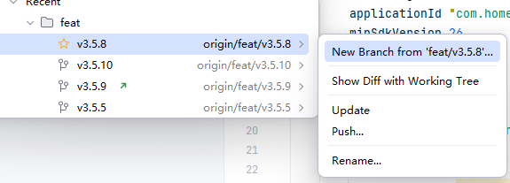
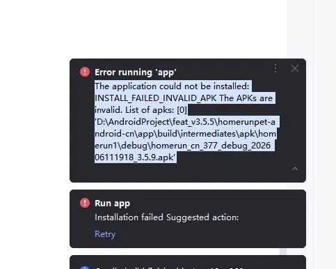

# git版本控制

日期：2026/06/09


## git指令
1.git remote -v   :git remote 是查看远程仓库配置，-v 是 verbose（详细）的缩写，意思是显示详细信息
2.git add commands/ contexts/
3.git commit -m "first commit"
4.git push -u origin main
---

### 上传项目中的部分文件到github，如何保证能将文件的本来结构也上传？
cd 你的项目目录

git init

git remote add origin https://github.com/hhhhh15/md_code.git

git add 文件1 文件2 目录1/        # ← 只加你想上传的

git status    #查看上传的东西

git commit -m "first commit"

git push -u origin main

### windows任务计划程序

    写脚本实现定时自动上传github
做法：win+s打开输入任务计时程序，创建基本任务，【
基本任务：向导模式，一步步引导，选项少，适合简单需求
创建任务：高级模式，可以设置更多条件（比如"只在联网时运行"），用基本任务就够了】


**代码解析：**
    @enco off                   ——关闭命令回显：关闭终端输入命令后的回复
    git diff --cached --quiet   ——检查git diff --cached暂存区有没有实际变更，--quiet表示不输出内容，只返回状态码

脚本代码：
```java
@echo off
cd /d C:\Users\homerun\.claude

git add commands/ contexts/

git status --short > nul 2>&1
git diff --cached --quiet
if %errorlevel% equ 0 (
    echo No changes to commit.
) else (
    git commit -m "auto update %date:~0,10% %time:~0,8%"
    git push origin main
)
```

---

### Android studio中merge合并代码步骤

1.第一步点击update，拉取云端代码
2.如果有冲突进入到这个页面，左边是我的版本，中间是要合并的版本，右边云端的代码，小心小心再小心啊，介绍一下这个里面的按钮，
            accept yours 
            accept theirs
            merge
,我昨天的错误就是有两个页面有冲突了，我直接accept yours，就是我的版本，然后gradle-wrapper.properties被中
distributionUrl=https\://mirrors.aliyun.com/macports/distfiles/gradle/gradle-7.5-bin.zip
需要升级到8.7，之后一系列问题导致apk解析有问题，安装不了，问题如图

——————原因不详，查过了。build过程中有异常但是没有终止，导致apk文件不完整，还是合并分支的时候要小心小心


### 本地和云端不一致
就是我现在本地的修改是和云端有问题的，那到底是怎么改，如果先将本地的push上去的话，不是和云端有区别吗

18:25
你不能直接 push，因为云端有你本地没有的提交，Git 会拒绝。


正确流程是：本地上传到仓库，云端拉取到仓库，然后就有仓库版本冲突，就要小心再小心的解决

1. 先把本地改动 commit

bash
git add .
git commit -m "我的修改"
2. 再 pull 云端

bash
git pull
3. 这时候如果有冲突，手动解决，解决完：

bash
git add .
git commit -m "resolve conflicts"
4. 最后 push

bash
git push


