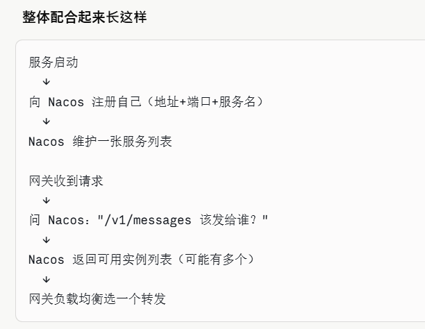

# 免费版使用CC

日期：2026-06-02

## 目标

1.能直接使用到cc的大模型  2.通过第三方平台使用到cc的大模型  3.cc通过协议转换使用别的大模型  4.连接中转站使用到大模型

## 概念解析
1.本地代理
2.API网关
    是服务器的统一入口服务，核心职责。整体使用技术逻辑
    ├── 1. 验证 Header 里的 API Key / Token，验证逻辑是从服务器数据库中查询
    ├── 2. 限流（这个 Key 今天调用次数超了吗）
    ├── 3. 路由（这个请求该发给哪个后端服务）
    └── 4. 转发 → 后端服务 A / B / C
    
    ·路由：
        /v1/message接口发送到模型推理服务，/v1/hhh接口发送到hhh服务。这个映射规则是在网关里面写的，或则是使用动态注册中心。

        ·动态注册中心：
            也是一个服务，服务的地址IP会改变，导致网关不知道将数据转发给谁。使用之后，服务会主动上报（地址+端口+服务名）。常用的注册中心软件有Nacos、Consul、Etcd等
            【服务的IP会改变，有可能，因为云服务器的IP就是会这样】
        
        
        
3.协议转换
协议转换，能让cc使用到别家的模型，✌
        场景一：
            需要下载node.ja,然后测试node -v, npm -v。然后使用指令全局下载【下载的位置我还是不知道下到哪里去了】，然后需要
            mkdir C:\Users\homerun\.claude-code-router
            notepad C:\Users\homerun\.claude-code-router\config.json创建这个config.json文件。

        场景二：
            通过将请求发送到第三方平台，第三方将请求发送到对应的模型中，
                Ⅰ.需要抓包分析Qoder请求格式
                Ⅱ.认证方式
                Ⅲ.转发工具

4.安全令牌和api key都是在登录凭证中使用的

# 场景二未来操作
1.配置ccr
2.偷第三方平台，写转发工具，类似krio-gateway【不会使】
3.或则有codex的模型也行，感觉deepseek的模型太不行了，然后配置到ccr里面

# ccr + ds_model + cc
1.感觉恋人的芯被替换了
2.迟早把模型给换了
3.使用教程
    3.1. cmd + ccr start
    3.2. cd 项目地址
    3.3. cmd +ccr code启动cc
4.ccr用不了，遂放弃

# 使用Qoder CLI
1.完全抄Claude code的架构，简直不要脸啊，但是方便我了，架构熟悉，直接使用，即可炼化

## MCP的介绍
有两种使用方式：


 MCP 实际工作方式：

   MCP server 不是"拉取代码"，而是本地已经安装好的进程，Qoder 通过协议和它通信，把它的能力（工具/资源）暴露给 AI 用。

   类比：
   - Qoder = 大脑（调用工具）
   - MCP server = 工具进程（已在你机器上跑起来）
   - 连接方式 = 两者之间的通信管道

   关于编译环境：

   - stdio 类型：Qoder 直接 npx xxx 或 python xxx 启动进程，编译/运行环境就是你本机，所以你需要提前装好 Node.js / Python 等
   - http/sse 类型：MCP server 跑在远程服务器上，编译环境在对方那边，你不用管

   所以 stdio 的前提是你本机有对应的运行时（你已经有 Node.js v24），npx 会自动下载并运行 MCP server 包，无需手动编译。

### 词语概念

1.MCP Server
    符合协议的工具程序，是需要包装成mcp协议的，形式是
        @playwright/mcp — 浏览器自动化
        @modelcontextprotocol/ser

Q:怎么包装自己的程序？
A：过程如下，假设有一个程序需要包装成mcp server：

     你的程序（Playwright）
        ↓
    npm install @modelcontextprotocol/sdk   ← 下载官方SDK
        ↓
    用 SDK 注册 Tool / Resource             ← 包装暴露功能  这个就是将功能包装暴露给ai调用，一般是js文件，要用到官方MCP SDK包装
        ↓
    npm publish 发布到 npm                  ← 上传
        ↓
    别人 npx 你的包名                       ← 下载并运行


项目结构如下：
  my-mcp-server/
    ├── package.json    ← 项目配置，声明依赖
    ├── index.js        ← MCP 注册，注册 Tool/Resource，启动 server
    ├── browser.js      ← 你的 Playwright 程序代码
    └── node_modules/

```js
 import { McpServer } from "@modelcontextprotocol/sdk/server/mcp.js";
    import { chromium } from "playwright";  // 你自己的程序

    const server = new McpServer({ name: "my-playwright", version: "1.0.0" });

    // 把 Playwright 的功能包装成 Tool 暴露给 AI
    server.tool("open-browser", { url: z.string() }, async ({ url }) => {
      const browser = await chromium.launch();
      const page = await browser.newPage();
      await page.goto(url);
      const title = await page.title();
      await browser.close();
      return { content: [{ type: "text", text: `页面标题: ${title}` }] };
    });
```

2.npx
     Node.js 自带的工具，临时下载并运行 npm 包，不用永久安装。npx -y @playwright/mcp 就是"下载并启动 Playwright MCP Server"


1.与MCP Server通信方式：
  | stdio | Qoder 直接在你电脑上启动程序，通过标准输入输出通信  | 本地工具，如 Playwright
  |  http | Qoder 发 HTTP 请求到某个地址                      | 远程服务器上的工具 
  |  sse  | 类似 http，但支持服务器主动推送                    | 远程流式服务

### 使用
1.将程序的MCP Serve配置，有用户级别（全局使用）和项目级别，
【AI对话后能自动加载的，用户级别绝对路径是"C:\Users\homerun\.qoder\settings.json"】

"mcpServers": {
    "playwright": {
      "type": "stdio",
      "command": "npx",
      "args": [
        "-y",
        "@playwright/mcp@latest"
      ]
    }
  }

type:协议方式
command：下载方式
-y:同意下载
@playwright/mcp@latest：mcp server


2.配置成功，运行/mcp reload生效

3.可以查看MCP Server的配置，指令/mcp,tools是暴露给ai调用的接口
ESC退出到对话，调用该服务
