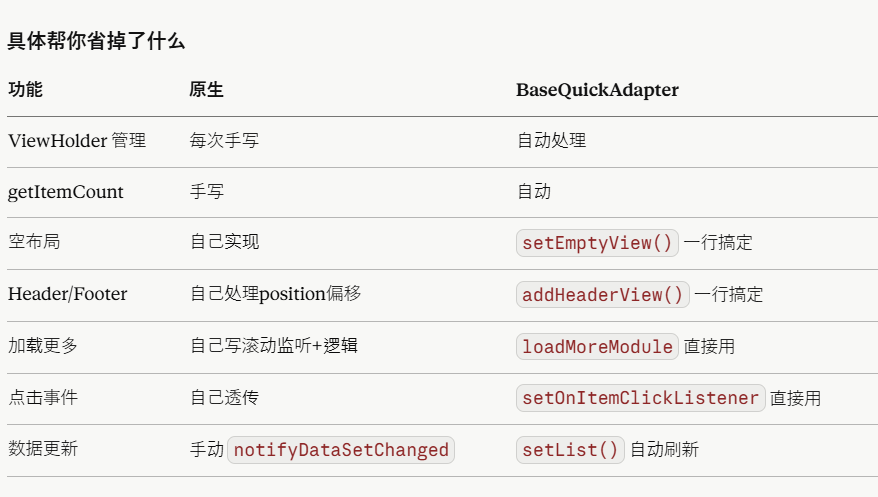

# 日期
创建于2026/06/01

# 👌项目中新的知识点：
## BRVAH（BaseRecyclerViewAdapterHelper） 库
1.创建adpter:BaseQuickAdapter<xxxx, BaseViewHolder> ,xxx是数据类，BaseViewHodler是Hodler
2.重载override fun convert(holder: BaseViewHolder, item: User) ~~~ onBindViewHolder
3.具体好处：以后再说，先用
4.override fun covert(){

}类似onBindViewHolder

---

## BRV
直接mBind.rv的recycleview控件setup{}使用链式配置

问题：   
1.这个model数据，也就是适配器的列表数据，在BRV就先直接模拟有这么一个数据是吗？那塞入的时机是在这个setup外面吗？
————后塞数据（可以任意时机，比如网络回调、SP读取后）
————mBind.rv.bindingAdapter.models = listOf(product1, product2)

        2.getBinding<RvItemProductBinding>()就是塞入的holder，这个方法是获取binding？


```java
//基础结构
        rv.setup {
            addType<Product>(R.layout.rv_item_product)   // 注册类型

            onCreateViewHolder(R.layout.rv_item_product) {
                // 类似 onCreateViewHolder，一般不需要手动写
            }

            onBind {
                // 类似 onBindViewHolder
                val model = getModel<Product>()  // 不传 position，默认取当前绑定位置
                getBinding<RvItemProductBinding>().tvName.text = model.name
            }

            R.id.sll_root.onClick {
                val model = getModel<Product>(layoutPosition)
            }
        }
//
        mBind.rv.setup {
            //addType注册类型
            addType<CategoryProductData>(R.layout.rv_item_category_product_lv1)
            addType<Product>(R.layout.rv_item_category_product_lv2)

            //
            onBind {
                when (val data = getModel<Any>()) {
                    is CategoryProductData -> {
                        getBinding<RvItemCategoryProductLv1Binding>().apply {
                            tvTitle.text = data.name
                        }
                    }

                    is Product -> {
                        getBinding<RvItemCategoryProductLv2Binding>().apply {
                            tvSubTitle.text = data.name
                            context.preloadImage(data.icon_url)
                            ivCover.loadWithSize(data.icon_url, 32.dp.toInt(), 32.dp.toInt())
                        }
                    }
                }
            }
            R.id.sll_root.onClick {
                val model = getModel<Product>(layoutPosition)
                DeviceNetResultV2Activity.originClass = ManualConnectionActivity::class.java
                ProvisionManager.getInstance(this@ManualConnectionActivity).setProduct(model)
                ConnectionGuideActivity.launch(1)
            }
        }
```


---
# 💀 kotlin常用代码

1.泛型类型:<T> 放在 fun 后面是告诉编译器：这个 T 是我自己定义的类型参数，不是某个具体类。

```java

fun <T> getModel():T{
    return T
}

class MyAdapter<T> {        // 类级别，整个类共用一个 T
    fun getModel(): T { }   // 这里 T 是类定义的，fun 后面不用再写 <T>
}

// vs

class MyAdapter {
    fun <T> getModel(): T { }  // 函数级别，每次调用可以是不同的 T
}

```

# 🤩项目中的关键代码功能：

## 整理文案
1.有一个方法就是动态映射文案的方法，getTextByKey
---

## sign签名字段来源
1.有很多接口Post的body是有sign签名的，包装在`ApiClient`(com/homerunpet/engine/ApiClient.java)里面，拼接请求参数，SH256
```java
```
---

## SPUtils是sdk包里面的，他的getInstance是什么意思呢？

这个是不是相当于sp，shareparence本地存储？put就是存的意思？
```java

//SPUtils

        public void put(@NonNull final String key, final String value) {
            put(key, value, false);
        }

        public static SPUtils getInstance(String spName, final int mode) {
            if (isSpace(spName)) spName = "spUtils";
            SPUtils spUtils = SP_UTILS_MAP.get(spName);
            if (spUtils == null) {
                synchronized (SPUtils.class) {
                    spUtils = SP_UTILS_MAP.get(spName);
                    if (spUtils == null) {
                        spUtils = new SPUtils(spName, mode);
                        SP_UTILS_MAP.put(spName, spUtils);
                    }
                }
            }
            return spUtils;
        }

//ProductUtils

     // 保存allowed_keys到SP
        if (allowedKeys.isNotEmpty()) {
            val distinctKeys = allowedKeys.distinct()
            SPUtils.getInstance().put(SPConstant.KEY_ALLOWED_KEYS, GsonUtils.toJson(distinctKeys))
        }
```
---


使用SPConstant保存就直接这样？        
        val versionKey = SPConstant.KEY_CATEGORY_PRODUCTS_VERSION
        val dataKey = SPConstant.KEY_GET_PRODUCT_JSON

调用以下方法，接口是/v1/devices/category-products，获取到品类产品
```java
//HmCommonNetUtils
    //
      /**
     * 获取品类产品 (做了缓存处理)
     */
    @JvmStatic
    @JvmOverloads
    fun fetchCategoryProducts(
        lifecycleOwner: LifecycleOwner,
        callback: HmNetworkCallback<List<CategoryProductData?>?>,
        isHandlerError: Boolean = false,
    ) {
        val versionKey = SPConstant.KEY_CATEGORY_PRODUCTS_VERSION
        val dataKey = SPConstant.KEY_GET_PRODUCT_JSON
        val localVersion = SPUtils.getInstance().getString(versionKey)

        lifecycleOwner.scopeNetLife {
            val res = Get<HMBaseResponse<List<CategoryProductData?>?>?>(HmApi.CATEGORY_PRODUCTS) {
                // 传递本地存储的 version 给服务端
                setQuery("version", localVersion.orEmpty())
            }.await()

            if (res?.data != null) {
                // 使用服务端返回的 version
                val remoteVersion = res.version

                // 如果本地 version 与服务端 version 一致，使用缓存
                if (!remoteVersion.isNullOrEmpty() && remoteVersion == localVersion) {
                    val cachedJson = SPUtils.getInstance().getString(dataKey)
                    if (!cachedJson.isNullOrEmpty()) {
                        try {
                            val cachedResponse: List<CategoryProductData?>? =
                                Gson().fromJson(cachedJson, object : TypeToken<List<CategoryProductData?>?>() {}.type)
                            callback.onSuccess(cachedResponse)
                            return@scopeNetLife
                        } catch (e: Exception) {
                            e.printStackTrace()
                        }
                    }
                }

                // 使用服务端数据并存储新的 version
                if (!remoteVersion.isNullOrEmpty()) {
                    SPUtils.getInstance().put(versionKey, remoteVersion)
                    val dataJson = Gson().toJson(res.data)
                    SPUtils.getInstance().put(dataKey, dataJson)
                }
                callback.onSuccess(res.data)
            } else if (res != null) {
                // 服务端返回了响应但 data 为 null，说明 version 一致，使用本地缓存
                val cachedJson = SPUtils.getInstance().getString(dataKey)
                if (!cachedJson.isNullOrEmpty()) {
                    try {
                        val cachedResponse: List<CategoryProductData?>? =
                            Gson().fromJson(cachedJson, object : TypeToken<List<CategoryProductData?>?>() {}.type)
                        callback.onSuccess(cachedResponse)
                        return@scopeNetLife
                    } catch (e: Exception) {
                        e.printStackTrace()
                    }
                }
                // 如果缓存不可用，返回空响应
                callback.onSuccess(null)
            }
        }.catch {
            // 尝试读取本地缓存兜底
            val cachedJson = SPUtils.getInstance().getString(dataKey)
            if (!cachedJson.isNullOrEmpty()) {
                try {
                    val cachedResponse: List<CategoryProductData?>? =
                        Gson().fromJson(cachedJson, object : TypeToken<List<CategoryProductData?>?>() {}.type)
                    callback.onSuccess(cachedResponse)
                    return@catch
                } catch (e: Exception) {
                    e.printStackTrace()
                }
            }
            if (it is Exception) {
                callback.onError(it)
            }
            if (isHandlerError) {
                handleError(it)
            }
        }
    }


```


## 强制绑定，只有同地区才能实现，否则一定要解绑

## 重新链接，这个功能一直没弄明白

## ble读取那个MTU字节的你也没看懂

## 域名和国家地区那个逻辑也没看懂

## 视频rawv转码MP4  [RawvConverter]
