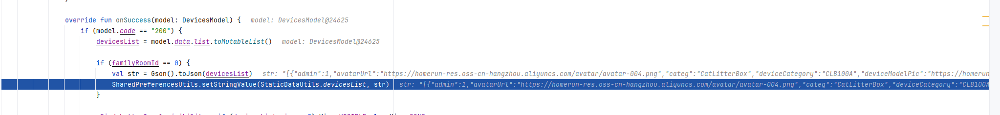
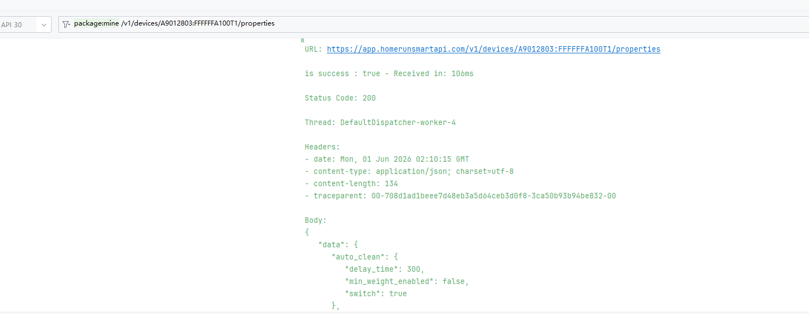
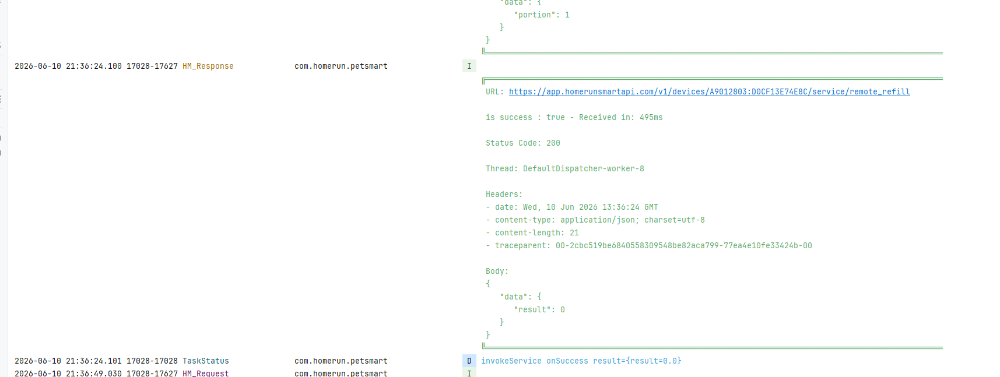
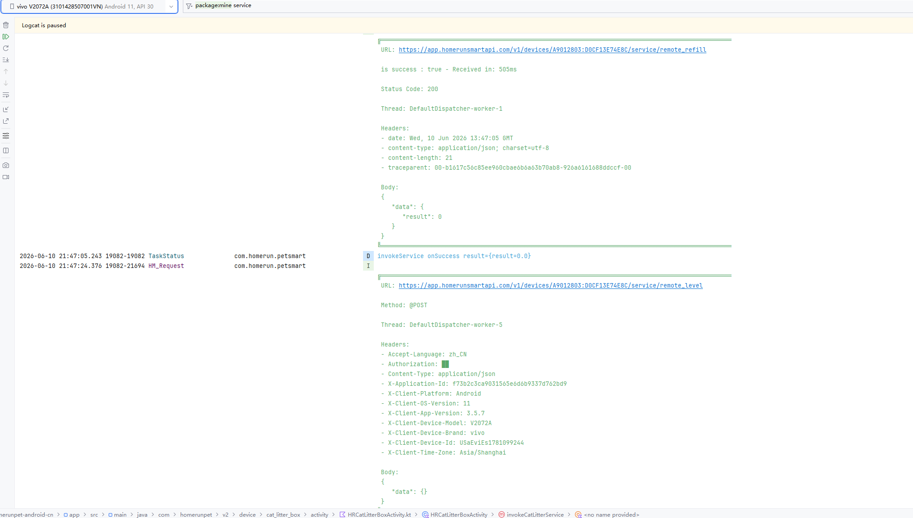

# 📅 日期
2026-05-20

# 📁 类名-分支名
`HRCatLitterBoxActivity` — `feat_v3.5.5`

# ← 来源文档
`读懂-HRCatLitterBoxActivity [猫砂盆设置页] -P0-2026-05-20.md`

---
# 新学到的东西
1.xml 里的 <include> 标签有没有写 android:id，有id就加一层，必须写id，直接用binding.closeBtn是用不了的


---


---

# 💀实现

## 实现1.添加补砂、开集便箱门、开口朝上按钮，物模型控制显隐actionItem

### 1. 添加元素到数组

问题：
1.100a补砂按钮对应的物模型是远程补砂remote_refill吗,那任务类型task_type里面的refilling加砂中是什么？
——加砂中是上报的一个补砂属性，设备在加砂的状态ing

2.100a和100a+的砂仓余量对应的物模型的标识符identifier是什么？
——是如厕桶，toilet_litter_status

3.100a补砂桶猫砂余量的物模型是refill_remain_status,100a+的补砂桶猫砂余量是refill_litter_status,这两个都是代表补砂桶猫砂余量吧，
——迁移的是100a+的物模型，所以用refill_litter_status

-------------------------------------------------------------------------------
4.这个 updateThingModelUI()中是父类HRBaseActivity中在oncreate()方法中的 fetchProductsThingMode()就被调用了，所以是最新的
那updateActionDisplayList()必须要关联啊
```java
//updateThingModel
//1.存所有按钮的identifier，然后过滤剩下当前设备物模型有的按钮
override fun updateThingModelUI() {
        super.updateThingModelUI()


        // 1. 余量监控区域
        val hasLitterStatus = thingModel?.getProperty(DevicePropertyConstants.TOILET_LITTER_STATUS) != null
        val hasWasteStatus = thingModel?.getProperty(DevicePropertyConstants.WASTE_BIN_FULL_STATUS) != null
        val hasRefillStatus = thingModel?.getProperty(DevicePropertyConstants.REFILL_LITTER_STATUS)!= null //补砂余量


        mBind.rlLitterAmount.visibleOrGone(hasLitterStatus)
        mBind.rlToiletBoxCapacity.visibleOrGone(hasWasteStatus)
        mBind.llMargin.visibleOrGone(hasLitterStatus || hasWasteStatus)

        /*100a+
             * */
        Log.d("ThingModel", "hasLitter=$hasLitterStatus, hasWaste=$hasWasteStatus, hasRefill=$hasRefillStatus")
        if(hasRefillStatus && hasWasteStatus && hasLitterStatus){
            mBind.llNewUi.visibleOrGone(true)
            mBind.llMargin.visibleOrGone(false)

            mBind.rlSurplus1.visibleOrGone(hasRefillStatus && hasLitterStatus)
            mBind.rlSurplus2.visibleOrGone(hasWasteStatus)
        }
        //存所有按钮的identifier，然后过滤剩下当前设备物模型有的按钮
        supportedModels=setOf(
            "remote_clean",
            "remote_level",
            "remote_empty",
            "remote_refill",
            "remote_lid",
            "remote_open_up"
        )
            .filter { it->thingModel.contains(it) }
            .toSet()

//updateActionDisplayList()
// 2.根据物模型过滤，物模型里有这个服务才保留
        val allActionItems = mutableListOf(
            ActionItem(getString(R.string.catlitterbox_btn_clean_now), R.mipmap.ic_quick_operation_clean_up, "remote_clean"),
            ActionItem(getString(R.string.catLitterBox_text_flatten), R.mipmap.ic_quick_operation_smooth_out, "remote_level"),
            ActionItem(getString(R.string.catlitterbox_text_sand_clearing_action), R.mipmap.ic_quick_operation_empty_the_cat_litter, "remote_empty"),
            ActionItem(getString(R.string.catLitterBox_text_refillCatLitter), R.mipmap.ic_quick_manual_san_replenishment, "remote_refill"),
            ActionItem(getString(R.string.catLitterBox_text_openToiletDoor), R.mipmap.ic_quick_open_toilet_collection_box_door, "remote_lid"),
            ActionItem(getString(R.string.catLitterBox_text_openUpwards), R.mipmap.ic_quick_open_upwards, "remote_open_up"),
        ).filter {
            it.identifier in supportedModels
        }.toMutableList()

```
--------------------------------------------------------


问题
1.方法中的thingModel是全量物模型吗?是从哪个接口获取到全量物模型啊，源头是在哪里？
——HRBaseDeviceActivity中的方法fetchProductsThingMode()
2.updateThingModelUI()被调用的地方还在activity的生命周期嘛，全量物模型和该方法调用前后是谁前？
——在initView()里面fetchxx调用了，所以是全量物模型在前面


## 2.thingModel物模型数据来源

```java

//HRBaseDeviceActivity中获取到的物模型全量，然后存储到thingModel变量里面，之后继承这个HRBaseDeviceActivity页面都可以用这个thingModel变量调用getProperty()方法获取到啥来着
/**
     * 获取产品物模型定义 (异步)
     */
    protected fun fetchProductsThingMode() {
        val pk = productKey.lowercase()
        lifecycleScope.launch(Dispatchers.IO) {
            val dataKey = SPConstant.KEY_THING_MODEL_DATA_PREFIX + pk
            val cachedJson = SPUtils.getInstance().getString(dataKey)

            // 1. 尝试从 SharedPreference 缓存读取
            if (!cachedJson.isNullOrEmpty()) {
                try {
                    val cachedModel = Gson().fromJson(cachedJson, HrProductsThingModel::class.java)
                    if (cachedModel != null) {
                        launch(Dispatchers.Main) {
                            thingModel = cachedModel
                            updateThingModelUI()
                        }
                        return@launch
                    }
                } catch (e: Exception) {
                    e.printStackTrace()
                }
            }

            // 2. 尝试从 Assets 核心库读取全量文件
            try {
                assets.open("products_all_thing_models.json").bufferedReader().use { it.readText() }.let { assetsJson ->
                    val type = object : TypeToken<HMBaseResponse<Map<String, HrProductsThingModel>>>() {}.type
                    val fullResponse: HMBaseResponse<Map<String, HrProductsThingModel>>? = Gson().fromJson(assetsJson, type)

                    val allModels = fullResponse?.data
                    if (allModels != null) {
                        val model = allModels[pk]
                        if (model != null) {
                            launch(Dispatchers.Main) {
                                thingModel = model
                                updateThingModelUI()
                            }
                            return@launch
                        }
                    }
                }
            } catch (e: Exception) {
                e.printStackTrace()
            }
        }
    }
    
    /**
     * 物模型加载成功后的解析回调
     */
    protected open fun updateThingModelUI() {

    }

//子类HRCatLitterBoxActivity里面重写了updateThingModelUI()
    /**
     * 根据物模型更新整体 UI 的显隐性 (功能裁剪)
     */
    override fun updateThingModelUI() {...}
```

----

# 实现2.DeviceCatLitterBoxCameraActivity->HRCatLitterBoxActivity猫砂余量数据显示的逻辑
5.25
这个点击集便箱余量的按钮100a和75v用的是同一个吗，因为跳转的页面不一样，是否要区分两个集便箱余量按钮————————按钮一样，我弄成id不一样的
砂仓余量的物模型是toilet_litter_status如厕桶猫砂余量，补砂桶余量物模型：refill_litter_status
    
    1.不改UI，还是覆盖，然后需要写三个状态的"充足",余量"充足"数据是要从接口获取的，然后展示到UI上面，HRCarLitter对此写的代码如下：onPropertyUpdate
    2.middle按钮跳转页面，HRCatLitter，intent传输记得放device_model


1.这个砂仓余量跳转，新页面跳转到旧页面，调用透传接口为啥用不了，这个方法不是直接下发接口的吗，是不是参数没有填写完整

2.跳转的逻辑还得看旧页面时怎么跳转的

只用看一点，就是跳转要传入一个device_model

综上所述：
1.余量UI的显示是要查看属性值的`{thingModel?.getProperty(DevicePropertyConstants.TOILET_LITTER_STATUS) }`，所调用的接口是`HmCommonNetUtils`中的fetchDeviceProperty(
        lifecycleOwner: LifecycleOwner,
        deviceName: String,
        callback: HmNetworkCallback<Map<String, Any?>>,
        isHandlerError: Boolean = false,
        useCache: Boolean = true,
    ),不直接用，套一层用`HRBaseDeviceActivity`中的`fetchDeviceProperty`

2.device_model数据来源

## 1.物模型属性Property来源
```java
//1 封装接口HmCommonNetUtils网络请求
 /**
     * 查询设备属性
     */
    @JvmStatic
    @JvmOverloads
    fun fetchDeviceProperty(
        lifecycleOwner: LifecycleOwner,
        deviceName: String,
        callback: HmNetworkCallback<Map<String, Any?>>,
        isHandlerError: Boolean = false,
        useCache: Boolean = true,
    ) {
        lifecycleOwner.scopeNetLife {
            // 网络请求（并写入缓存）
            val data = Get<Map<String, Any?>>(HmApi.getDeviceProperty(deviceName)) {
                setCacheKey("device_prop_$deviceName")
                setCacheMode(CacheMode.WRITE)
            }.await()
            callback.onSuccess(data)
        }.let { scope ->
            if (useCache) {
                scope.preview {
                    // 先读取缓存
                    val cachedData = Get<Map<String, Any?>>(HmApi.getDeviceProperty(deviceName)) {
                        setCacheKey("device_prop_$deviceName")
                        setCacheMode(CacheMode.READ)
                    }.await()
                    callback.onSuccess(cachedData)
                }.catch { }
            }
            scope
        }.catch {
            if (it is Exception) {
                callback.onError(it)
            }
            if (isHandlerError) {
                handleError(it)
            }
        }
    }

//2. HRBaseDeviceActivity调用fetchDeviceProperty()方法，封了一层不用填写方法参数

    /**
     * 获取设备属性
     * @param useCache 是否优先使用缓存
     */
    protected fun fetchDeviceProperty(useCache: Boolean = true) {
        val serial = deviceSerial.uppercase()
        HmCommonNetUtils.fetchDeviceProperty(
            this, serial,
            object : HmNetworkCallback<Map<String, Any?>> {
                override fun onSuccess(result: Map<String, Any?>) {
                    // 统一提取实时在线状态
                    if (result.containsKey(DevicePropertyConstants.ONLINE_STATUS)) {
                        status = if (result[DevicePropertyConstants.ONLINE_STATUS].toSafeBoolean()) 1 else 0
                    }
                    onPropertyUpdate(result)
                }

                override fun onError(error: Exception) {
                    onPropertyError(error)
                }
            }, useCache = useCache
        )
    }
```


## 2.物模型属性展示余量UI
```java
//updateThingModelUI() 
// 1.物模型属性控制显隐 updateThingModelUI()
override fun updateThingModelUI() {
        super.updateThingModelUI()

        // 1. 余量监控区域
        val hasLitterStatus = thingModel?.getProperty(DevicePropertyConstants.TOILET_LITTER_STATUS) != null
        val hasWasteStatus = thingModel?.getProperty(DevicePropertyConstants.WASTE_BIN_FULL_STATUS) != null
        val hasRefillStatus = thingModel?.getProperty(DevicePropertyConstants.REFILL_LITTER_STATUS)!= null //补砂余量

        
        mBind.rlLitterAmount.visibleOrGone(hasLitterStatus)
        mBind.rlToiletBoxCapacity.visibleOrGone(hasWasteStatus)
        mBind.llMargin.visibleOrGone(hasLitterStatus || hasWasteStatus)

        
        /*100a+
             * */
        if(hasRefillStatus && hasWasteStatus && hasLitterStatus){
            mBind.llNewUi.visibleOrGone(true)
            mBind.llMargin.visibleOrGone(false)

            mBind.rlSurplus1.visibleOrGone(hasRefillStatus && hasLitterStatus)
            mBind.rlSurplus2.visibleOrGone(hasWasteStatus)
        }


        updateFragmentStatus()
    }

//onPropertyUpdate()更新“充足”数据
override fun onPropertyUpdate(result: Map<String, Any?>) {
        mBind.prlContent.finishRefresh()
        // 状态映射：区分“实时传感器数据”与“用户受控状态”

        // --- A. 传感器数据更新 (仅当数据变动时更新 UI 文字/颜色) ---
        if (result.containsKey(DevicePropertyConstants.TOILET_LITTER_STATUS)) {
            val toiletRemainStatus = result[DevicePropertyConstants.TOILET_LITTER_STATUS].toSafeBoolean()

            mBind.tvLitterAmountValue.text =
                if (toiletRemainStatus) getString(R.string.catlitterbox_label_sufficient) else getString(R.string.catlitterbox_label_insufficient)
            mBind.tvLitterAmountValue.setTextColor(if (toiletRemainStatus) getCompatColor(R.color.color_383231) else getCompatColor(R.color.color_ff2742))

            //100a+ 砂仓余量
            mBind.tvSandBinValue.text=
                if (toiletRemainStatus) getString(R.string.catlitterbox_label_sufficient) else getString(R.string.catlitterbox_label_insufficient)
            mBind.tvSandBinValue.setTextColor(if (toiletRemainStatus) getCompatColor(R.color.color_383231) else getCompatColor(R.color.color_ff2742))

        }

        //1000a+补砂桶余量
        if(result.containsKey(DevicePropertyConstants.REFILL_LITTER_STATUS)){
            val refillRemainStatus=result[DevicePropertyConstants.REFILL_LITTER_STATUS].toSafeBoolean()
            mBind.tvSandReplenishmentBucketValue.text=
                if(refillRemainStatus)getString(R.string.catlitterbox_label_sufficient) else getString(R.string.catlitterbox_label_insufficient)
            mBind.tvSandReplenishmentBucketValue.setTextColor(if (refillRemainStatus) getCompatColor(R.color.color_383231) else getCompatColor(R.color.color_ff2742))

        }

        if (result.containsKey(DevicePropertyConstants.WASTE_BIN_FULL_STATUS)) {
            val wasteBinStatus = result[DevicePropertyConstants.WASTE_BIN_FULL_STATUS].toSafeBoolean()
            mBind.tvToiletBoxValue.text =
                if (wasteBinStatus) getString(R.string.common_text_notEnough) else getString(R.string.catLitterBox_text_normal)
            mBind.tvToiletBoxValue.setTextColor(if (wasteBinStatus) getCompatColor(R.color.color_ff2742) else getCompatColor(R.color.color_383231))

            //100a+集便箱门
            mBind.tvToiletWasteTankValue.text=
                if (wasteBinStatus) getString(R.string.common_text_notEnough) else getString(R.string.catLitterBox_text_normal)
            mBind.tvToiletBoxValue.setTextColor(if (wasteBinStatus) getCompatColor(R.color.color_ff2742) else getCompatColor(R.color.color_383231))
        }
 
```
## 3.device_model数据来源
```java

——DeviceCatLitterBoxCameraActivity
    //跳转页面逻辑，
            case R.id.surplus_btn_1:
                intent = new Intent(mContext, DeviceCatLitterBoxSurplusActivity.class);
                intent.putExtra("device_model", device_model);
                intent.putExtra("type", 0);
                startActivity(intent);
                break;
            case R.id.surplus_btn_2:
                intent = new Intent(mContext, DeviceCatLitterBoxSurplusActivity.class);
                intent.putExtra("device_model", device_model);
                intent.putExtra("type", 1);
                startActivity(intent);
                break;

//1.
abstract class HRBaseDeviceActivity<VB : ViewBinding> : HMBaseActivity<BaseViewModel, VB>() {

    // region ------------------------------ 变量 ------------------------------

    /**
     * 获取传入的设备模型信息数据实体 (由子类从 Intent 中获取)
     */
    protected open val deviceModel: DevicesModel.DataDTO.ListDTO? by lazy {
        intent.getSerializableExtra("device_model") as? DevicesModel.DataDTO.ListDTO
    }

    
//是从HomeV2Fragment获取到的
//2.HomeV2Fragment
    // 列表点击事件
    private fun itemClick() {
        homePlaceAdapter.setOnItemClickListener { _, _, position ->
            for (i in roomList.indices) {
                roomList[i].isSelect = false
            }
            familyRoomId = roomList[position].id
            roomList[position].isSelect = true
            homePlaceAdapter.setList(roomList)

            getDeviceList()
        }


 //家庭设备列表
    @POST("/app/v1/devices/list")
    Single<DevicesModel> devicesList(@Body Map<String, Object> params);


        // 获取设备列表
    private fun getDeviceList() {
        val params: MutableMap<String, Any> = HashMap()
        params["familyId"] = familyId
        if (familyRoomId != 0) {
            params["familyRoomId"] = familyRoomId
        }
        params["page"] = page
        params["limit"] = limit
        val map = ApiClient.createParam(params)
        apiService.devicesList(map)
            .subscribeOn(Schedulers.io())
            .observeOn(AndroidSchedulers.mainThread())
            .subscribe(object : SingleObserver<DevicesModel> {
                override fun onSubscribe(d: Disposable) {
                }

                override fun onSuccess(model: DevicesModel) {
                    if (model.code == "200") {
                        devicesList = model.data.list.toMutableList()

                        if (familyRoomId == 0) {
                            val str = Gson().toJson(devicesList)
                            SharedPreferencesUtils.setStringValue(StaticDataUtils.devicesList, str)
                        }

                        mBind.bottomIcon1.visibility = if (devicesList.size < 3) View.VISIBLE else View.GONE
                        mBind.bottomIcon2.visibility = if (devicesList.size < 3) View.GONE else View.VISIBLE
                        homeDeviceAdapter.setNewInstance(devicesList)
                        mBind.recyclerView.visibility = if (devicesList.size == 0) View.GONE else View.VISIBLE
                        mBind.noDeviceView.visibility = if (devicesList.size == 0) View.VISIBLE else View.GONE
                    } else {
                        mBind.recyclerView.visibility = View.GONE
                        mBind.noDeviceView.visibility = View.VISIBLE

                        SharedPreferencesUtils.setStringValue(StaticDataUtils.devicesList, "")
                    }
                }

                override fun onError(e: Throwable) {
                }
            })
    }

      

```


## 4.按钮跳转

```java

        listOf(mBind.rlSurplus1 to 0,mBind.rlSurplus2 to 1).forEach {(view, type) ->
            view.singleClick {
                val intent = Intent(this, DeviceCatLitterBoxSurplusActivity::class.java)
                intent.putExtra("device_model", deviceModel)
                intent.putExtra("type", type)
                startActivity(intent)
            }  }
```


# 实现3.HRCatLitterBoxActivity.java，是要根据设备序列号获取到动态的属性值列表

```java
//0.这个变量是记录状态的，有DeviceTaskType类写着各种区别的状态，但是我不知道这个状态是每次发送请求的时候返回的还是自己修改，因为invokeCatLitterService里面有调用
    private var taskType = DeviceTaskType.IDLE
    private var taskStatus = DeviceTaskStatus.IDLE


//DevicePropertyConstants类记录物模型的属性内容标识符。位置在com/homerunpet/v2/common/constants/DevicePropertyConstants.kt
object DevicePropertyConstants {
        // 9. 事件上报 (Struct: pet_excretion_report)
    const val PET_EXCRETION_REPORT = "pet_excretion_report" // 宠物排泄事件
    const val VIDEO_ID = "video_id" // 视频ID
    const val PET_ID = "pet_id" // 宠物ID
    const val CONFIDENCE = "confidence" // 置信度
    const val DURATION = "duration" // 持续时长
    const val FILL_LIGHT_SWITCH = "fill_light_switch" // 补光灯开关
    const val FILL_LIGHT_CAT_INSIDE = "fill_light_cat_inside" // 补光灯猫咪进入开启
    const val FILL_LIGHT_CLEANUP = "fill_light_cleanup" // 补光灯清理任务开启
    const val FILL_LIGHT_BRIGHTNESS = "fill_light_brightness" // 补光灯亮度

}
//ProductUtils [app/src/main/java/com/homerunpet/v2/common/utils/ProductUtils.kt]
/**
     * 根据设备序列号获取产品信息
     */
    fun getProductByDeviceSerial(deviceSerial: String?): Product? {
        val processedSerialKey = deviceSerial
            ?.substringBefore(":")
            ?.uppercase(Locale.getDefault())
            .orEmpty()

        val spJson = SPUtils.getInstance().getString(SPConstant.KEY_GET_PRODUCT_JSON, "")
        return spJson.takeIf { !it.isNullOrEmpty() }
            ?.let {
                runCatching {
                    GsonUtils.fromJson<List<CategoryProductData?>?>(
                        it,
                        object : TypeToken<List<CategoryProductData?>?>() {}.type
                    )
                }.getOrNull()
            }
            ?.let { flattenCategoryProducts(it) }
            ?.find { product ->
                product.product_keys?.any { key ->
                    key.equals(processedSerialKey, ignoreCase = true)
                } == true
            }
    }
// 设备序列号获取产品信息
//1.1获取设备是否有IPC摄像头，跟actionItem有关,查看摄像头是否存在的地方在
//initView()的获取到设备摄像头的信息，updateActionDisplayList是被initActionToolbar()调用
    override fun initView(savedInstanceState: Bundle?) {
        lifecycleScope.launch {
            // 1. 耗时解析：获取产品详情（包含是否带摄像头等 HW 信息）
            val product = withContext(Dispatchers.IO) {
                ProductUtils.getProductByDeviceSerial(productKey)
            }
            hasCamera = product?.is_ipc == true
                        // 2. 基础业务数据初始化
            // 预取设备时区并存入全局缓存
            fetchDeviceTimeZone()

            // 3. UI 组件装载
            initLayoutConstraints()
            initWeekList()
            initActionCategoryList()
            initRvPetList()
            initRvDurationPetList()
            initRVEvents()
            initActionToolbar()
        }

    }

```

---

不对，75v上报的数据
 "current_task": {
        "task_status": 1,
        "task_type": 6
    },

      val currentTaskObj = result[DevicePropertyConstants.CURRENT_TASK]
       if (currentTaskObj is Map<*, *>) {
                taskTypeCode = (currentTaskObj[DevicePropertyConstants.TASK_TYPE] as? Number)?.toInt() ?: 0
                taskStatusCode = (currentTaskObj[DevicePropertyConstants.TASK_STATUS] as? Number)?.toInt() ?: 0
            }

            this.taskType = DeviceTaskType.fromCode(taskTypeCode)
            this.taskStatus = DeviceTaskStatus.fromCode(taskStatusCode)

        然后这个数据呀对应，靠啊
，
# 实现4.根据物模型task_type任务类型控制底部操作栏运行UI

5.26
问题：
    1.下发和上报，远程控制remote_control_task是上报，咋上报的？下发是任务类型，接口和方法调用如下：——上报就是机器上报到云端，然后我们调接口去查云端，就知道机器是什么状态了 ，所以是通过轮询获取到云端的设备状态，在onPropertyUpdate()方法执行，调用的接口xxxx就是下发
    2.点击补砂按钮，下发设备，然后UI显示底部操作栏，handleActionClick()中就是控制这个UI变化，通过`DeviceTaskType`还有`DeviceTaskStatus`来判断目前的任务类型是个什么状态，
        2.1只有补砂这个状态是在DeviceTaskType中有的，后面在改，改完再说
        2.2开集便箱门和开口朝上的底部操作栏是怎么更新的？这两个不是任务类型task_type里面

问题：
1.刚开始点击开盖，发送的是什么消息，接口没有数据，看对应的物模型里面只有三个状态，停止、取消？

## 接口下发服务代码
```java

    // 下发设备服务 HmApi(com/homerunpet/v2/base/net/HmApi.kt)
    fun postInvokeDeviceService(device_name: String, identifier: String) = "/v1/devices/$device_name/service/$identifier"

  // 下发设备服务  com/homerunpet/v2/common/utils/HmCommonNetUtils.kt
    @JvmStatic
    @JvmOverloads
    fun fetchInvokeDeviceService(
        activity: FragmentActivity,
        deviceName: String,
        identifier: String,
        params: Map<String, Any?>,
        callback: HmNetworkCallback<Any?>,
        isHandlerError: Boolean = true
    ) {
        activity.scopeDialog {
            val res = Post<Any?>(HmApi.postInvokeDeviceService(deviceName, identifier)) {
                json(mapOf("data" to params))
            }.await()
            callback.onSuccess(res)
        }.catch {
            if (it is Exception) {
                callback.onError(it)
            }
            if (isHandlerError) {
                handleError(it)
            }
        }
    }

    /**
     * 下发设备服务指令（同步操作，下发前自动开启防回跳保护）
     */
    protected fun invokeDeviceService(identifier: String, params: Map<String, Any?>, callback: HmNetworkCallback<Any?>? = null) {
        val serial = deviceSerial.uppercase()
        HmCommonNetUtils.fetchInvokeDeviceService(this, serial, identifier, params, callback ?: object : HmNetworkCallback<Any?> {
            override fun onSuccess(result: Any?) {}
            override fun onError(error: Exception) {}
        })
    }
    
/**
     * 合并统一下发猫砂盆各项服务指令（包含设备返回状态的统一校验，result == 0 时才认为成功并执行状态模拟）
     * @param serviceId  服务标识 (e.g. "remote_clean", "remote_level", "remote_control_task")
     * @param params     附加参数
     * @param actionName 操作名称 (用于 Toast 成功提示)，为空则不提示
     * @param mockTaskType   回调成功后模拟的 task_type，为空则不模拟
     * @param mockTaskStatus 回调成功后模拟的 task_status，为空则不模拟
     */
    private fun invokeCatLitterService(
        serviceId: String,
        params: Map<String, Any?> = mapOf(),
        actionName: String? = null,
        mockTaskType: Int? = null,
        mockTaskStatus: Int? = null
    ) {
        invokeDeviceService(serviceId, params, object : HmNetworkCallback<Any?> {
            override fun onSuccess(result: Any?) {
                if (result is Map<*, *>) {
                    val resultCode = (result["result"] as? Number)?.toInt() ?: -1
                    if (resultCode == 0) {
                        // 1. 成功了才进入防回跳状态
                        markActionTime()

                        // 2. 如果传了提示名，则 Toast 提示
                        actionName?.let { Toaster.show(getString(R.string.catlitterbox_text_command_sent_to_device, it)) }//已经下发xx指令
                        if (mockTaskType != null && mockTaskStatus != null) {
                            handleDeviceTaskStatus(
                                mapOf(
                                    DevicePropertyConstants.CURRENT_TASK to mapOf(
                                        DevicePropertyConstants.TASK_TYPE to mockTaskType,
                                        DevicePropertyConstants.TASK_STATUS to mockTaskStatus
                                    )
                                )
                            )
                        }
                    } else {
                        Toaster.show(CatLitterBoxTaskResult.getMsg(resultCode))
                    }
                }
            }

            override fun onError(error: Exception) {
            }
        })
    }

```


## 业务代码
```java

//1.handleDeviceTaskStatus()
    private fun handleDeviceTaskStatus(result: Map<String, Any?>) {
        try {
            val currentTaskObj = result[DevicePropertyConstants.CURRENT_TASK]
            var taskTypeCode = "idle"
            var taskStatusCode = 0

            if (currentTaskObj is Map<*, *>) {
                taskTypeCode = (currentTaskObj[DevicePropertyConstants.TASK_TYPE] as? String) ?: "idle"
                taskStatusCode = (currentTaskObj[DevicePropertyConstants.TASK_STATUS] as? Number)?.toInt() ?: 0
            }

            this.taskType = DeviceTaskType.fromCode(taskTypeCode)
            this.taskStatus = DeviceTaskStatus.fromCode(taskStatusCode)

            // 猫咪进入
            this.isCatInside = (result[DevicePropertyConstants.CAT_INSIDE] as? Boolean) == true
            // 猫咪靠近
            this.isCatNear = (result[DevicePropertyConstants.CAT_NEARBY] as? Boolean) == true

            // 检查当前任务是否属于“活跃运行”或“活跃暂停”状态 (清理、清砂、抚平、复位、加砂)
            if ((taskType == DeviceTaskType.CLEANING || taskType == DeviceTaskType.EMPTYING || taskType == DeviceTaskType.SMOOTHING || taskType == DeviceTaskType.RESETTING || taskType == DeviceTaskType.REFILLING ) &&
                (taskStatus == DeviceTaskStatus.RUNNING || taskStatus == DeviceTaskStatus.PAUSED)
            ) {
                // 如果当前正在操作，则展示“正在执行”浮窗层
                if (mBind.sllCurrentTask.visibility != View.VISIBLE) {
                    val transition = TransitionSet().apply {
                        addTransition(Fade())
                        duration = 400
                        addTarget(mBind.llBottomControl)
                        addTarget(mBind.sllCurrentTask)
                    }
                    TransitionManager.beginDelayedTransition(mBind.root as ViewGroup, transition)
                }
                mBind.llBottomControl.visibility = View.GONE
                mBind.sllCurrentTask.visibility = View.VISIBLE

                // 默认可见并可用，特殊状态下隐藏或置灰
                mBind.llCancel.visibility = View.VISIBLE
                mBind.llContinuePause.visibility = View.VISIBLE
                mBind.llCancel.alpha = 1.0f
                mBind.llCancel.isEnabled = true
                mBind.llContinuePause.alpha = 1.0f
                mBind.llContinuePause.isEnabled = true

                if (taskType == DeviceTaskType.RESETTING) {
                    // 复位中，隐藏取消按钮，但可以暂停
                    mBind.llCancel.visibility = View.GONE
                }

                if (isCatInside || isCatNear) {
                    // 检测到猫咪靠近或进入
                    mBind.tvEventDesc.text =
                        if (isCatInside) getString(R.string.catlitterbox_text_cat_inside_suspended) else getString(R.string.catlitterbox_text_cat_near_suspended)

                    // 按钮置灰百分之50，且不可点击
                    mBind.llCancel.alpha = 0.5f
                    mBind.llCancel.isEnabled = false
                    mBind.llContinuePause.alpha = 0.5f
                    mBind.llContinuePause.isEnabled = false

                    // 图标展示为“继续”状态
                    mBind.tvPauseContinue.text = getString(R.string.catlitterbox_button_continue)
                    mBind.ivPauseContinue.setImageResource(R.mipmap.ic_equipment_continue)
                } else {
                    if (taskStatus == DeviceTaskStatus.PAUSED) {
                        // 暂停中
                        mBind.tvEventDesc.text = getString(R.string.catlitterbox_text_device_suspended)
                        mBind.tvPauseContinue.text = getString(R.string.catlitterbox_button_continue)
                        mBind.ivPauseContinue.setImageResource(R.mipmap.ic_equipment_continue)
                    } else {
                        // 运行中
                        when (taskType) {
                            DeviceTaskType.RESETTING -> mBind.tvEventDesc.text = getString(R.string.catlitterbox_text_status_resetting)
                            DeviceTaskType.CLEANING -> mBind.tvEventDesc.text = getString(R.string.catlitterbox_text_status_cleaning)
                            DeviceTaskType.EMPTYING -> mBind.tvEventDesc.text = getString(R.string.catlitterbox_text_status_sand_clearing)
                            DeviceTaskType.REFILLING->mBind.tvEventDesc.text = getString(R.string.catlitterbox_text_status_sand_refilling)
                            else -> mBind.tvEventDesc.text = getString(R.string.catlitterbox_text_status_leveling)
                        }

                        mBind.tvPauseContinue.text = getString(R.string.catlitterbox_button_pause)
                        mBind.ivPauseContinue.setImageResource(R.mipmap.ic_equipment_on)
                    }
                }

                // 设置事件图标（无论运行还是暂停，左侧图标都跟当前任务类型一致）
                when (taskType) {
                    DeviceTaskType.RESETTING -> mBind.ivEventIcon.setImageResource(R.mipmap.ic_quick_operation_reset)
                    DeviceTaskType.CLEANING -> mBind.ivEventIcon.setImageResource(R.mipmap.ic_quick_operation_clean_up)
                    DeviceTaskType.EMPTYING -> mBind.ivEventIcon.setImageResource(R.mipmap.ic_quick_operation_empty_the_cat_litter)
                    DeviceTaskType.REFILLING->mBind.ivEventIcon.setImageResource(R.mipmap.ic_quick_manual_san_replenishment)
                    else -> mBind.ivEventIcon.setImageResource(R.mipmap.ic_quick_operation_smooth_out)
                }
            } else {
                // 任务状态为：已完成(3)、已失败(4)、已取消(5)、待运行(0) 或 空闲时
                if (mBind.llBottomControl.visibility != View.VISIBLE) {
                    val transition = TransitionSet().apply {
                        addTransition(Fade())
                        duration = 400
                        addTarget(mBind.llBottomControl)
                        addTarget(mBind.sllCurrentTask)
                    }
                    TransitionManager.beginDelayedTransition(mBind.root as ViewGroup, transition)
                }
                mBind.llBottomControl.visibility = View.VISIBLE
                mBind.sllCurrentTask.visibility = View.GONE
            }
            updateTitleStatus()
        } catch (e: Exception) {
            e.printStackTrace()
        }
    }

//2.updateTitleStatus()   
//更新头部的设备状态
              /**
                 * 更新标题栏状态文案
                 * 优先级：离线 > 有任务（暂停 > 运行）> 无任务（如厕中 > 在线）
                 */
 private fun updateTitleStatus() {
        if (!checkOnline(showToast = false)) {
            // 1. 设备离线状态
            mBind.tvStatus.text = getString(R.string.common_text_offline)
            mBind.llOffline.visible()
            mBind.llAbnormalMessage.gone()
        } else {
            // 2. 设备在线状态，需根据当前任务类型和状态动态显示
            mBind.llOffline.gone()

            // 判断是否存在活跃控制任务（铲屎、清砂、抚平、复位，且处于运行或暂停状态）
            val hasActiveTask =
                (taskType == DeviceTaskType.CLEANING || taskType == DeviceTaskType.EMPTYING || taskType == DeviceTaskType.SMOOTHING || taskType == DeviceTaskType.RESETTING) &&
                        (taskStatus == DeviceTaskStatus.RUNNING || taskStatus == DeviceTaskStatus.PAUSED)

            if (hasActiveTask) {
                // 情况A：有任务执行中
                if (isCatInside || isCatNear || taskStatus == DeviceTaskStatus.PAUSED) {
                    // 如果任务被阻断（猫咪靠近/进入）或者手动暂停，统一显示“设备b暂停中”
                    mBind.tvStatus.text = getString(R.string.catlitterbox_text_device_suspended)
                } else {
                    // 正常运行中的具体任务文案
                    Log.d("homerunxxxx","查看一下当前的任务类型${taskType}")
                    mBind.tvStatus.text = when (taskType) {
                        DeviceTaskType.CLEANING -> getString(R.string.catlitterbox_text_cleaning)
                        DeviceTaskType.EMPTYING -> getString(R.string.catlitterbox_text_sand_clearing)
                        DeviceTaskType.SMOOTHING -> getString(R.string.catlitterbox_text_leveling)
                        DeviceTaskType.MAINTAINING -> getString(R.string.catlitterbox_status_maintaining)
                        DeviceTaskType.REFILLING -> getString(R.string.catlitterbox_text_sand_refilling)
                        DeviceTaskType.RESETTING -> getString(R.string.catlitterbox_text_resetting)
                        else -> getString(R.string.petDryer_text_onLine)
                    }
                }
            } else {
                // 情况B：无任何活跃任务（空闲期）
                if (isCatInside) {
                    // 虽然没任务，但猫咪正在桶内，显示“猫咪如厕中”
                    mBind.tvStatus.text = getString(R.string.catlitterbox_status_cat_toilet)
                } else {
                    // 真正的空闲在线状态
                    mBind.tvStatus.text = getString(R.string.petDryer_text_onLine)
                }
            }
        }
    }


//3.handleActionClick
//处理点击事件
/**
     * 快捷操作点击事件
     */
     private fun handleActionClick(model: ActionItem) {
        if (!checkDeviceOperable()) return
        if (isCatInside) {
            Toaster.show(R.string.catlitterbox_toast_cat_inside_operable)
            return
        }
        if (isCatNear) {
            Toaster.show(R.string.catlitterbox_toast_cat_near_operable)
            return
        }
        when (model.identifier) {
            // 立即清理
            "remote_clean" -> {
                XPopup.Builder(this).asCustom(
                    HMCommonDialogActionAllTitleTwoBtn(
                        this,
                        isShowTitle = false,
                        content = getString(R.string.catlitterbox_text_confirm_clean_content),
                        title = ""
                    )
                        .apply {
                            rightClickMethod = {
                                invokeCatLitterService(
                                    "remote_clean",
                                    actionName = getString(R.string.catlitterbox_text_clean),
                                    mockTaskType = DeviceTaskType.CLEANING.code,
                                    mockTaskStatus = DeviceTaskStatus.RUNNING.code
                                )
                                dismiss()
                            }
                            leftClickMethod = {
                                dismiss()
                            }
                        }
                ).show()
            }

            // 铺平
            "remote_level" -> {
                XPopup.Builder(this).asCustom(
                    HMCommonDialogActionAllTitleTwoBtn(
                        this,
                        isShowTitle = false,
                        content = getString(R.string.catlitterbox_text_confirm_level_content),
                        title = ""
                    )
                        .apply {
                            rightClickMethod = {
                                invokeCatLitterService(
                                    "remote_level",
                                    actionName = getString(R.string.catlitterbox_text_level),
                                    mockTaskType = DeviceTaskType.SMOOTHING.code,
                                    mockTaskStatus = DeviceTaskStatus.RUNNING.code
                                )
                                dismiss()
                            }
                            leftClickMethod = {
                                dismiss()
                            }
                        }
                ).show()
            }

            // 清空猫砂
            "remote_empty" -> showEmptyCatLitterDialog()

            //开口朝上[服务]
            "remote_open_up"->{
                XPopup.Builder(this).asCustom(
                    HMCommonDialogActionAllTitleTwoBtn(
                        this,
                        isShowTitle = false,
                        content = getString(R.string.catlitterbox_text_confirm_open_up_content),
                        title = ""
                    )
                        .apply {
                            rightClickMethod = {
                                invokeCatLitterService(
                                    "remote_open_up",
                                    actionName = getString(R.string.catLitterBox_text_openUpwards),
//                                    mockTaskType = DeviceTaskType.SMOOTHING.code,
                                    mockTaskStatus = DeviceTaskStatus.RUNNING.code
                                )
                                dismiss()
                            }
                            leftClickMethod = {
                                dismiss()
                            }
                        }
                ).show()

            }


            //开集便箱门[服务]
            "remote_lid"->{
                XPopup.Builder(this).asCustom(
                    HMCommonDialogActionAllTitleTwoBtn(
                        this,
                        isShowTitle = false,
                        content = getString(R.string.catlitterbox_text_confirm_remote_lid_content),
                        title = ""
                    )
                        .apply {
                            rightClickMethod = {
                                invokeCatLitterService(
                                    "remote_lid",
                                    params = mapOf("switch" to true),
                                    actionName = getString(R.string.catLitterBox_text_openToiletDoor),
//                                    mockTaskType = DeviceTaskType.SMOOTHING.code,
                                    mockTaskStatus = DeviceTaskStatus.RUNNING.code
                                )
                                dismiss()
                            }
                            leftClickMethod = {
                                dismiss()
                            }
                        }
                ).show()


            }

            //手动补砂[服务]
            "remote_refill"->showAddNum()


        }
    }


```
## 接口数据
onPropertyUpdate()的result数据来源,以下两个方法弄出来的

所以那个
handleDeviceTaskStatus(result: Map<String, Any?>) {
    currentTaskObj = result[DevicePropertyConstants.CURRENT_TASK]
看调用handleDeviceTaskStatus的方法有以下onPropertyUpdate()\invokeCatLitterService()
invokeCatLitterService()只是单独的一个方法，是在点击操作方法里面被调用的

//HmCommonNetUtils
```java
/**
     * 查询设备属性
     */
    @JvmStatic
    @JvmOverloads
    fun fetchDeviceProperty(
        lifecycleOwner: LifecycleOwner,
        deviceName: String,
        callback: HmNetworkCallback<Map<String, Any?>>,
        isHandlerError: Boolean = false,
        useCache: Boolean = true,
    ) {
        lifecycleOwner.scopeNetLife {
            // 网络请求（并写入缓存）
            val data = Get<Map<String, Any?>>(HmApi.getDeviceProperty(deviceName)) {
                setCacheKey("device_prop_$deviceName")
                setCacheMode(CacheMode.WRITE)
            }.await()
            callback.onSuccess(data)
        }.let { scope ->
            if (useCache) {
                scope.preview {
                    // 先读取缓存
                    val cachedData = Get<Map<String, Any?>>(HmApi.getDeviceProperty(deviceName)) {
                        setCacheKey("device_prop_$deviceName")
                        setCacheMode(CacheMode.READ)
                    }.await()
                    callback.onSuccess(cachedData)
                }.catch { }
            }
            scope
        }.catch {
            if (it is Exception) {
                callback.onError(it)
            }
            if (isHandlerError) {
                handleError(it)
            }
        }
    }

```

---

HRBaseDeviceActivity
```java

   */
    protected fun fetchDeviceProperty(useCache: Boolean = true) {
        val serial = deviceSerial.uppercase()
        HmCommonNetUtils.fetchDeviceProperty(
            this, serial,
            object : HmNetworkCallback<Map<String, Any?>> {
                override fun onSuccess(result: Map<String, Any?>) {
                    // 统一提取实时在线状态
                    if (result.containsKey(DevicePropertyConstants.ONLINE_STATUS)) {
                        status = if (result[DevicePropertyConstants.ONLINE_STATUS].toSafeBoolean()) 1 else 0
                    }
                    onPropertyUpdate(result)
                }

                override fun onError(error: Exception) {
                    onPropertyError(error)
                }
            }, useCache = useCache
        )
    }
```


onPropertyUpdate()
```java
 override fun onPropertyUpdate(result: Map<String, Any?>) {
        mBind.prlContent.finishRefresh()
        // 状态映射：区分“实时传感器数据”与“用户受控状态”
        Log.d("PropertyKeys", "all keys=${result.keys}")
        Log.d("PropertyUpdate", "llNewUi visibility=${mBind.llNewUi.visibility}")
        mBind.llNewUi.post {
            Log.d("UICheck", "llNewUi height=${mBind.llNewUi.height}, width=${mBind.llNewUi.width}")
            Log.d("UICheck", "tvSandBinValue text=${mBind.tvSandBinValue.text}")
            Log.d("UICheck", "tvSandReplenishmentBucketValue text=${mBind.tvSandReplenishmentBucketValue.text}")
            Log.d("UICheck", "tvToiletWasteTankValue text=${mBind.tvToiletWasteTankValue.text}")
        }
        // --- A. 传感器数据更新 (仅当数据变动时更新 UI 文字/颜色) ---

        if (result.containsKey(DevicePropertyConstants.TOILET_LITTER_STATUS)) {
            val toiletRemainStatus = result[DevicePropertyConstants.TOILET_LITTER_STATUS].toSafeBoolean()

            mBind.tvLitterAmountValue.text =
                if (toiletRemainStatus) getString(R.string.catlitterbox_label_sufficient) else getString(R.string.catlitterbox_label_insufficient)
            mBind.tvLitterAmountValue.setTextColor(if (toiletRemainStatus) getCompatColor(R.color.color_383231) else getCompatColor(R.color.color_ff2742))

            //100a+ 砂仓余量
            mBind.tvSandBinValue.text=
                if (toiletRemainStatus) getString(R.string.catlitterbox_label_sufficient) else getString(R.string.catlitterbox_label_insufficient)
            mBind.tvSandBinValue.setTextColor(if (toiletRemainStatus) getCompatColor(R.color.color_383231) else getCompatColor(R.color.color_ff2742))

        }

        //100a+补砂桶余量
        if(result.containsKey(DevicePropertyConstants.REFILL_LITTER_STATUS)){
            val refillRemainStatus=result[DevicePropertyConstants.REFILL_LITTER_STATUS].toSafeBoolean()
            mBind.tvSandReplenishmentBucketValue.text=
                if(refillRemainStatus)getString(R.string.catlitterbox_label_sufficient) else getString(R.string.catlitterbox_label_insufficient)
            mBind.tvSandReplenishmentBucketValue.setTextColor(if (refillRemainStatus) getCompatColor(R.color.color_383231) else getCompatColor(R.color.color_ff2742))

        }

        if (result.containsKey(DevicePropertyConstants.WASTE_BIN_FULL_STATUS)) {
            val wasteBinStatus = result[DevicePropertyConstants.WASTE_BIN_FULL_STATUS].toSafeBoolean()
            mBind.tvToiletBoxValue.text =
                if (wasteBinStatus) getString(R.string.common_text_notEnough) else getString(R.string.catLitterBox_text_normal)
            mBind.tvToiletBoxValue.setTextColor(if (wasteBinStatus) getCompatColor(R.color.color_ff2742) else getCompatColor(R.color.color_383231))

            //100a+集便箱门
            mBind.tvToiletWasteTankValue.text=
                if (wasteBinStatus) getString(R.string.common_text_notEnough) else getString(R.string.catLitterBox_text_normal)
            mBind.tvToiletWasteTankValue.setTextColor(if (wasteBinStatus) getCompatColor(R.color.color_ff2742) else getCompatColor(R.color.color_383231))
        }


        // --- B. 受动作保护的状态（根据是否有指令下发后的保护期决定是否更新） ---
        if (isActionProtecting()) {
            // 保护期内：忽略可能包含旧数据的属性上报，仅根据最新在线状态刷新标题
            updateTitleStatus()
        } else {
            // 正常期：全量同步任务状态及各项开关设置

            // 核心任务流解析
            handleDeviceTaskStatus(result)  //将这个result传入到核心控制显示底部UI的方法

            // 同步基础设置状态（仅用于各入口 Summary 显示或状态同步）
            if (result.containsKey(DevicePropertyConstants.AUTO_CLEAN)) {
                (result[DevicePropertyConstants.AUTO_CLEAN] as? Map<*, *>)?.let { struct ->
                    this.isAutoCleanEnabled = struct[DevicePropertyConstants.SWITCH].toSafeBoolean()
                }
            }

            if (result.containsKey(DevicePropertyConstants.KITTEN_MODE_SWITCH)) {
                this.isKittenModeEnabled = result[DevicePropertyConstants.KITTEN_MODE_SWITCH].toSafeBoolean()
            }

            if (result.containsKey(DevicePropertyConstants.AUTO_COVER_SWITCH)) {
                this.isAutoBuryEnabled = result[DevicePropertyConstants.AUTO_COVER_SWITCH].toSafeBoolean()
            }

            if (result.containsKey(DevicePropertyConstants.FAN_SPEED)) {
                this.fanSpeed = result[DevicePropertyConstants.FAN_SPEED].toSafeInt(2)
                this.isFanEnabled = this.fanSpeed > 0
            }
        }

        // 摄像头配套属性同步 (不受操作保护限制)
        if (hasCamera) {
            if (result.containsKey(DevicePropertyConstants.FILL_LIGHT_SWITCH)) {
                this.isFillLightOn = result[DevicePropertyConstants.FILL_LIGHT_SWITCH].toSafeBoolean()
                hrTuTkLiveStreamFragment?.updateFillLightStatus(isFillLightOn)
            }

            if (result.containsKey(DevicePropertyConstants.CAMERA_SWITCH)) {
                this.isCameraOn = result[DevicePropertyConstants.CAMERA_SWITCH].toSafeBoolean()
                hrTuTkLiveStreamFragment?.updateCameraSwitch(isCameraOn)
            }

            if (result.containsKey(DevicePropertyConstants.MIC_SWITCH)) {
                this.isMicOn = result[DevicePropertyConstants.MIC_SWITCH].toSafeBoolean()
                hrTuTkLiveStreamFragment?.updateMicStatus(isMicOn)
            }

            if (result.containsKey(DevicePropertyConstants.CAMERA_STATUS)) {
                this.cameraStatus = result[DevicePropertyConstants.CAMERA_STATUS].toSafeInt(1)
                hrTuTkLiveStreamFragment?.updateCameraStatus(cameraStatus)
            }
        }
        updateFragmentStatus()

        // 离线遮罩逻辑
        val isOnline = checkOnline(showToast = false)
        mBind.vOutlineBottomControl.visibility = if (!isOnline) View.VISIBLE else View.GONE
        mBind.vOutlineCurrentTask.visibility = if (!isOnline && mBind.sllCurrentTask.visibility == View.VISIBLE) View.VISIBLE else View.GONE
    }
```

---
handleActionClick(model: ActionItem) 
```java
     /**
     * 快捷操作点击事件
     */
    private fun handleActionClick(model: ActionItem) {
        if (!checkDeviceOperable()) return
        if (isCatInside) {
            Toaster.show(R.string.catlitterbox_toast_cat_inside_operable)
            return
        }
        if (isCatNear) {
            Toaster.show(R.string.catlitterbox_toast_cat_near_operable)
            return
        }
        when (model.identifier) {
            // 立即清理
            "remote_clean" -> {
                XPopup.Builder(this).asCustom(
                    HMCommonDialogActionAllTitleTwoBtn(
                        this,
                        isShowTitle = false,
                        content = getString(R.string.catlitterbox_text_confirm_clean_content),
                        title = ""
                    )
                        .apply {
                            rightClickMethod = {
                                invokeCatLitterService(
                                    "remote_clean",
                                    actionName = getString(R.string.catlitterbox_text_clean),
                                    mockTaskType = DeviceTaskType.CLEANING.code,
                                    mockTaskStatus = DeviceTaskStatus.RUNNING.code
                                )
                                dismiss()
                            }
                            leftClickMethod = {
                                dismiss()
                            }
                        }
                ).show()
            }

            // 铺平
            "remote_level" -> {
                XPopup.Builder(this).asCustom(
                    HMCommonDialogActionAllTitleTwoBtn(
                        this,
                        isShowTitle = false,
                        content = getString(R.string.catlitterbox_text_confirm_level_content),
                        title = ""
                    )
                        .apply {
                            rightClickMethod = {
                                invokeCatLitterService(
                                    "remote_level",
                                    actionName = getString(R.string.catlitterbox_text_level),
                                    mockTaskType = DeviceTaskType.SMOOTHING.code,
                                    mockTaskStatus = DeviceTaskStatus.RUNNING.code
                                )
                                dismiss()
                            }
                            leftClickMethod = {
                                dismiss()
                            }
                        }
                ).show()
            }

            // 清空猫砂
            "remote_empty" -> showEmptyCatLitterDialog()

            //开口朝上[服务]
            "remote_open_up"->{
                XPopup.Builder(this).asCustom(
                    HMCommonDialogActionAllTitleTwoBtn(
                        this,
                        isShowTitle = false,
                        content = getString(R.string.catlitterbox_text_confirm_open_up_content),
                        title = ""
                    )
                        .apply {
                            rightClickMethod = {
                                invokeCatLitterService(
                                    "remote_open_up",
                                    actionName = getString(R.string.catLitterBox_text_openUpwards),
//                                    mockTaskType = DeviceTaskType.SMOOTHING.code,
                                    mockTaskStatus = DeviceTaskStatus.RUNNING.code
                                )
                                dismiss()
                            }
                            leftClickMethod = {
                                dismiss()
                            }
                        }
                ).show()

            }
```

invokeCatLitterService()
```java
/**
     * 合并统一下发猫砂盆各项服务指令（包含设备返回状态的统一校验，result == 0 时才认为成功并执行状态模拟）
     * @param serviceId  服务标识 (e.g. "remote_clean", "remote_level", "remote_control_task")
     * @param params     附加参数
     * @param actionName 操作名称 (用于 Toast 成功提示)，为空则不提示
     * @param mockTaskType   回调成功后模拟的 task_type，为空则不模拟
     * @param mockTaskStatus 回调成功后模拟的 task_status，为空则不模拟
     */
    private fun invokeCatLitterService(
        serviceId: String,
        params: Map<String, Any?> = mapOf(),
        actionName: String? = null,
        mockTaskType: String? = null,
        mockTaskStatus: Int? = null
    ) {
        invokeDeviceService(serviceId, params, object : HmNetworkCallback<Any?> {
            override fun onSuccess(result: Any?) {
                if (result is Map<*, *>) {
                    val resultCode = (result["result"] as? Number)?.toInt() ?: -1
                    if (resultCode == 0) {
                        // 1. 成功了才进入防回跳状态
                        markActionTime()

                        // 2. 如果传了提示名，则 Toast 提示
                        actionName?.let { Toaster.show(getString(R.string.catlitterbox_text_command_sent_to_device, it)) }
                        if (mockTaskType != null && mockTaskStatus != null) {
                            handleDeviceTaskStatus(
                                mapOf(
                                    DevicePropertyConstants.CURRENT_TASK to mapOf(
                                        DevicePropertyConstants.TASK_TYPE to mockTaskType,
                                        DevicePropertyConstants.TASK_STATUS to mockTaskStatus
                                    )
                                )
                            )
                        }
                    } else {
                        Toaster.show(CatLitterBoxTaskResult.getMsg(resultCode))
                    }
                }
            }

            override fun onError(error: Exception) {
            }
        })
    }
```

---
# 实现5.修改跳转进HRCatLitterBoxActivity设置页面

逻辑：是通过pk来决定调用的是哪一个设置页面
```java

    companion object {
        private const val KEY_FROM = "from"
        private const val KEY_DEVICE_MODEL = "device_model"
        private const val SP_KEY_CHART_COLLAPSED = "sp_key_chart_collapsed"
        private const val SP_KEY_DURATION_CHART_COLLAPSED = "sp_key_duration_chart_collapsed"

        @JvmStatic
        @JvmOverloads
        fun intent(model: DevicesModel.DataDTO.ListDTO, memberType: Int = -1, from: Int = 0): Intent {
            val cls = if (ProductUtils.isSelfDevelopedCatLitterBox(model.model)) {
                HRCatLitterBoxActivity::class.java
            } else {
                DeviceCatLitterBoxCameraActivity::class.java
            }
            return Intent(Utils.getApp(), cls).apply {
                putExtra(KEY_DEVICE_MODEL, model)
                putExtra(KEY_MEMBER_TYPE, memberType)
                putExtra(KEY_FROM, from)
            }
        }

//ProductUtils,这个是pk，不是设备序列号吧，卧槽，我还是分不清，pk表示是空净一个系列的，序列号是确定的产品
object ProductUtils {

    const val MODEL_CAT_LITTER_BOX_A1 = "A9015201"
    const val MODEL_CAT_LITTER_BOX_A2 = "A9015202"
    const val MODEL_CAT_LITTER_BOX_B1 = "B9015201"
    const val MODEL_CAT_LITTER_BOX_B2 = "B9015202"

    /**
     * 是否是自研猫砂盆
     */
    @JvmStatic
    fun isSelfDevelopedCatLitterBox(model: String?): Boolean {
        val uppercaseModel = model?.uppercase(Locale.getDefault())
        return uppercaseModel == MODEL_CAT_LITTER_BOX_A1 || 
               uppercaseModel == MODEL_CAT_LITTER_BOX_A2 || 
               uppercaseModel == MODEL_CAT_LITTER_BOX_B1 || 
               uppercaseModel == MODEL_CAT_LITTER_BOX_B2
    

```


# 实现6.可能需要修改的余量页面HRCatLitterBoxRemainingActivity

切换页面逻辑：根据传入的type来区分展示不同的fragment页面
```java

//HRCatLitterBoxRemainingActivity
 /**
     * 统一刷新余量状态 UI（优先级：故障信息 > 物模型状态）
     */
    private fun updateRemainingUI() {
        when (type) {
            0 -> {
                // 1. 检查“砂仓未安装”状态（优先级最高）
                if (!isToiletInPlace) {
                    mBind.ivLitterImg.load(R.mipmap.ic_clb_litter_bin_not_installed_75v)
                    mBind.tvRemainingPercentage.text = getString(R.string.catlitterbox_remaining_sand_bin_not_in_place)
                    mBind.tvRemainingPercentage.setTextColor(getColor(R.color.color_ff2742))
                    return
                }

                // 2. 物模型常规状态：充足/不足
                mBind.tvRemainingPercentage.text = if (toiletRemainStatus) getString(R.string.catlitterbox_text_sufficient) else getString(R.string.catlitterbox_text_insufficient)
                mBind.tvRemainingPercentage.setTextColor(
                    if (toiletRemainStatus) getColor(R.color.colorDefaultText) else getColor(R.color.color_ff2742)
                )
                mBind.ivLitterImg.load(
                    if (toiletRemainStatus) R.mipmap.ic_clb_litter_bin_sufficient_75v else R.mipmap.ic_clb_litter_bin_insufficient_75v
                )
            }

            1 -> {
                // 1. 检查“集便箱未安装”状态（优先级最高）
                if (!isWasteBinInPlace) {
                    mBind.ivLitterImg.load(R.mipmap.ic_clb_feces_box_not_installed_75v)
                    mBind.tvRemainingPercentage.text = getString(R.string.catlitterbox_remaining_waste_bin_not_in_place)
                    mBind.tvRemainingPercentage.setTextColor(getColor(R.color.color_ff2742))
                    return
                }

                // 2. 物模型常规状态：正常/不足 (wasteBinStatus = true 表示空间不足，即满)
                mBind.tvRemainingPercentage.text =
                    if (wasteBinStatus) getString(R.string.catlitterbox_text_full) else getString(R.string.catlitterbox_text_normal)

                mBind.tvRemainingPercentage.setTextColor(
                    if (wasteBinStatus) getColor(R.color.color_ff2742) else getColor(R.color.colorDefaultText)
                )

                mBind.ivLitterImg.load(
                    if (wasteBinStatus) R.mipmap.ic_clb_feces_box_full_75v else R.mipmap.ic_clb_feces_box_sufficient_75v
                )
            }
        }
    }
```

#  解决7.
问题：
    1.我找不到为啥补砂的时候titile不更新，明明查了tasktype是有值的，我怀疑是异步的原因
    2。虚拟设备跳转弹窗的时候，devcie——model是空的，需要查看一下homev2fragment的   这个接口有没有值
     //家庭设备列表
    @POST("/app/v1/devices/list")
    Single<DevicesModel> devicesList(@Body Map<String, Object> params);
    
    3.远程控制任务(remote_control_task)的物模型，这个就是下发操作
        
        Ⅰ下发服务->
        Ⅱ调用这个接口    // 下发设备服务fun postInvokeDeviceService(device_name: String, identifier: String) = "/v1/devices/$device_name/service/   $identifier"->
        Ⅲ返回响应{"result":0}，对应的物模型是远程控制任务remote_control_task里面的结果

    4.上报属性
        Ⅰ通过轮询->
        Ⅱ调用接口->
        Ⅲ获取到当前的任务对应的物模型是current_task，提取任务类型task_type和任务状态task_status更新状态中的UI->
        Ⅳ
    问题：那这个远程控制任务的action是在哪个下发接口有更改吗？不对，是状态中点击暂停是不是调用了什么接口，下发服务，输入action？
    ——有，是在方法onBindViewClick()里面，调用的invokeCatLitterBoxService(action)。只是serviceId都固定是remote_control_task了
    invokeCatLitterBoxService(action)
    └→ invokeCatLitterService(serviceId = "remote_control_task", params = mapOf("action" to action))
        └→ invokeDeviceService(serviceId, params, callback)  // 真正下发到云端

    5.就是问题2,核实一下
查过了，有数据的啊，如图


问题6.所以余量页面为啥device_model是没有的啊，是不是intent的有问题。？
——查到原因了，是因为虚拟设备上报的属性也就是接口xxx，虚拟设备上报的数据是只有三个


    //家庭设备列表
    @POST("/app/v1/devices/list")
    Single<DevicesModel> devicesList(@Body Map<String, Object> params);

    //家庭共享
    //家庭列表
    @POST("/app/v1/family/list")
    Single<FamilyListModel> familyList(@Body Map<String, Object> params);

    这两个接口还是有区别的哈

//HomeV2Fragment
```java

    // 列表点击事件
    private fun itemClick() {
        homePlaceAdapter.setOnItemClickListener { _, _, position ->
            for (i in roomList.indices) {
                roomList[i].isSelect = false
            }
            familyRoomId = roomList[position].id
            roomList[position].isSelect = true
            homePlaceAdapter.setList(roomList)

            getDeviceList()
        }

        // 获取设备列表
    private fun getDeviceList() {
        val params: MutableMap<String, Any> = HashMap()
        params["familyId"] = familyId
        if (familyRoomId != 0) {
            params["familyRoomId"] = familyRoomId
        }
        params["page"] = page
        params["limit"] = limit
        val map = ApiClient.createParam(params)
        apiService.devicesList(map)
            .subscribeOn(Schedulers.io())
            .observeOn(AndroidSchedulers.mainThread())
            .subscribe(object : SingleObserver<DevicesModel> {
                override fun onSubscribe(d: Disposable) {
                }

                override fun onSuccess(model: DevicesModel) {
                    if (model.code == "200") {
                        devicesList = model.data.list.toMutableList()

                        if (familyRoomId == 0) {
                            val str = Gson().toJson(devicesList)
                            SharedPreferencesUtils.setStringValue(StaticDataUtils.devicesList, str)
                        }

                        mBind.bottomIcon1.visibility = if (devicesList.size < 3) View.VISIBLE else View.GONE
                        mBind.bottomIcon2.visibility = if (devicesList.size < 3) View.GONE else View.VISIBLE
                        homeDeviceAdapter.setNewInstance(devicesList)
                        mBind.recyclerView.visibility = if (devicesList.size == 0) View.GONE else View.VISIBLE
                        mBind.noDeviceView.visibility = if (devicesList.size == 0) View.VISIBLE else View.GONE
                    } else {
                        mBind.recyclerView.visibility = View.GONE
                        mBind.noDeviceView.visibility = View.VISIBLE

                        SharedPreferencesUtils.setStringValue(StaticDataUtils.devicesList, "")
                    }
                }

                override fun onError(e: Throwable) {
                }
            })
    }


//        
        listOf(mBind.rlSurplus1 to 0,mBind.rlSurplus2 to 1).forEach {(view, type) ->
            view.singleClick {
                val intent = Intent(this, DeviceCatLitterBoxSurplusActivity::class.java)
                intent.putExtra("device_model", deviceModel)
                intent.putExtra("type", type)
                startActivity(intent)
            }  }
```


查过接口了，补砂是成功返回的

但是数据太快了，轮询查属性

难道是下发返回多了一个字段result？但是这个 this.taskType = DeviceTaskType.fromCode(taskTypeCode)，是根据属性返回的啊
                val rawTaskType = currentTaskObj[DevicePropertyConstants.TASK_TYPE]
                taskTypeCode = getTaskTypeCodeFromSpecs(rawTaskType)



维护就是开口朝上
1.原来的取消按钮样式转换成复位，在task_type=5 && task_status=1），这个复位按钮是灰的，
    维护类型中，task_type=5
    1.1 任务状态task_status=1  || task_status=2  ，复位是灰的

2.等状态是（task_type=5 && task_status=0），复位按钮可以点击，并且暂停和继续按钮隐藏，并且中间的文字改成已完成开口朝上
3.开口复位中是task_type=6，并且复位按钮消失，暂停和继续按钮显示

1.已完成开口朝上的任务面板修改分支 🆗
2.复位按钮是之前
