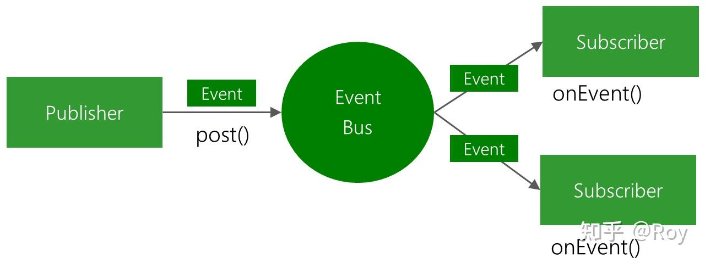

# 📅 日期

2026-04-17

# 🏷️ 优先级
- [x] P0 — 马上要用到，必须搞懂
- [ ] P1 — 近期会用到
- [ ] P2 — 了解就好
- [ ] P3 — 先记录，以后再看

# 📁 类名 — 分支名

`CameraFragment` + `FullScreenRealTimeActivity` — `feat_v3.5.5`

# 🎯 本次阅读目标

> 理解实时视频流的完整原理：数据怎么来、SurfaceView 怎么用、小屏↔全屏如何无缝切换、全屏页面各操作的完整链路

# 积累的知识点

> 禁止填写，用户会自己粘贴复制他认为要积累的
**概念问题**
[]1.RTSP是怎么实现从软件层获取到设备的实时视频流的？
[]2.实时视频流不上传云端，直接客户端到设备拿的数据？
[]3.实时视频流的传输数据形式是什么？
4.对于这个渲染页面，都是用SurfaceView，理解，解码和倍速和清晰度，放大都是视频播放控件控制的吗？
5.为啥这个视频在第一次退出后，没有退出app，第二次打开这个，不显示视频内容，问题代码是在哪里？
6.硬件合成器是什么东西，sdk解码线程代码在哪里，SurfaceHolder是什么东西，干嘛用的？
7.摄像头计划是客户端控制显示视频播放页面，回放需要录制视频，录制逻辑是什么，查了不写在app,那写在设备端固件是只要开着摄像头就一直录制吗？查了录制视频有两种存储方式，云存储和本地sd卡，所以设备端是怎么写录制逻辑上传到云端的？

## 知识点1：完整端到端视频流链路

  【摄像头侧 - 持续运行】                      【客户端侧 - 用户触发】
  摄像头持续采集+编码                       客户端 SDK 登录，获取 accessToken
  输出压缩码流待取                                   ↓
         ↓  (流媒体协议取流)                      萤石云信令层判断网络拓扑
          RTSP、萤石私有协议                              ├─ 同局域网 → 直接给设备局域网IP → 内网直连
          └──────────────────────────────────────────┘   ├─ 跨网络  → 协助P2P打洞 → P2P取流
                                                         └─ 打洞失败 → 分配中转节点 → 流媒体中转
                                     
                                ↓
                        startRealPlay() 建立连接通道
                          ├─ 内网直连
                          ├─ P2P取流
                          └─ 云端中转(流媒体取流)
                                ↓
                        客户端 SDK（EZPlayer）接收码流（H.264/H.265）
                                ↓
                        解码（MediaCodec 硬解） → 原始像素帧
                                ↓
                        直接写入 SurfaceHolder 的 Surface 缓冲区，渲染到 SurfaceView → 用户看到画面

## 知识点2：萤石sdk预览取流方式

**P2P取流**
  需要信令层做NAT穿透，
  

## 知识点3：RTSP Real-Time Streaming Protocol，实时流媒体的控制协议

类比HTTP但用于视频流：
  HTTP:  GET /page.html        → 返回静态内容
  RTSP:  **PLAY rtsp://ip/stream** → 返回持续的视频流
  
  rtsp://ip/stream这是摄像头暴露的直接取流地址，任何支持RTSP的播放器都能播：
    VLC / ffmpeg / ExoPlayer
          ↓
  rtsp://192.168.1.100:554/stream1
          ↓
  摄像头直接吐流（不需要任何SDK）

  554是RTSP默认端口，stream1 是摄像头固件定义的路径（各品牌不同）。RTSP通常使用在局域网直连，萤石取流协议是私有协议。
  
**总结：RTSP是会话控制协议——负责告诉摄像头"开始推流/停止/暂停"，本身不传视频数据**

## 知识点4：流媒体协议 = 解决"视频数据怎么从A传到B"的问题
 
 包含两个子问题：
  1. 数据怎么打包传输（RTP/RTMP/HLS）
  2. 会话怎么建立和控制（RTSP/SDP）

  
  ┌────────┬───────────────────┬─────────────────────────┐
  │  协议  │      控制层        │       数据传输层        │
  ├────────┼───────────────────┼─────────────────────────┤
  │ RTSP   │ RTSP（控制指令）   │ RTP（传视频数据）       │
  ├────────┼───────────────────┼─────────────────────────┤
  │ WebRTC │ SDP（协商参数）    │ RTP/SRTP（传数据）      │
  ├────────┼───────────────────┼─────────────────────────┤
  │ RTMP   │ 自己包含控制+数据  │ 无需RTP，自己的帧格式   │
  ├────────┼───────────────────┼─────────────────────────┤
  │ HLS    │ 无控制层           │ HTTP分段下载（.ts文件） │
  ├────────┼───────────────────┼─────────────────────────┤
  │ MJPEG  │ 无控制层           │  HTTP连续传JPEG图片      │
  └────────┴───────────────────┴─────────────────────────┘

问题：实时流需要控制层控制暂停/停止吗？
——类似http的请求指令：
PLAY->开始取流
TEARDOWN->停止取流
PAUSE->暂停取流
SEEK->跳转某个节点

  点播视频（录像回放）→ 需要 play/pause/seek
  实时预览（摄像头）  → 只需要 start/stop，不需要 seek


## 知识点5：视频播放器的原理

  数据输入（网络流/本地文件）
    └─ 解封装（mp4/rtsp/私有协议 → 分离音视频）
         └─ 解码（H.264/H.265 → 原始像素帧）
              └─ 音视频同步
                   └─ 输出 → 需要一个"画布"来显示

  播放器只做上面这条流水线，最后一步输出画面需要你给它一个 SurfaceView/TextureView。

## 知识点6：视频播放器的对比和使用场景

  ┌──────────┬─────────────────────────────┬─────────────────────────────────┬────────────────────────────┐
  │  对比点  │          VideoView          │            ExoPlayer            │      EZPlayer（萤石）      │
  ├──────────┼─────────────────────────────┼─────────────────────────────────┼────────────────────────────┤
  │ 本质     │ 播放器 + SurfaceView 的封装 │ 纯播放器引擎                    │ 纯播放器引擎               │
  ├──────────┼─────────────────────────────┼─────────────────────────────────┼────────────────────────────┤
  │ 渲染控件 │ 内置 SurfaceView，不用管    │ 需要自己提供 PlayerView/Surface │ 需要自己提供 SurfaceHolder │
  ├──────────┼─────────────────────────────┼─────────────────────────────────┼────────────────────────────┤
  │ 支持协议 │ 本地文件/HTTP/HLS           │ 几乎所有主流协议                │ 萤石私有协议/RTSP          │
  ├──────────┼─────────────────────────────┼─────────────────────────────────┼────────────────────────────┤
  │ 使用场景 │ 简单本地/网络视频           │ 通用视频播放                    │ 萤石摄像头实时流/回放      │
  └──────────┴─────────────────────────────┴─────────────────────────────────┴────────────────────────────┘

## 知识点7：EventBus介绍和简单使用

 是一个应用内消息总线，解决不同组件之间传消息的问题。原理如下图：
      //图1：EventBus工作原理

**使用场景**
-不跳转页面，但需要通知其他组件更新UI；
-Fragment 之间通信；
-下载/推送完成 → 多个页面响应；

组件通信vs Bundle：bundle主要是单向的，A跳转B的

**注册/注销作用**
EventBus.getDefault().register()
 -EventBus 扫描该页面[CameraFragment] 所有方法
    └─ 找到 @Subscribe 注解的方法
    └─ 记录：MessageEvent类型

**匹配规则**

  post() 参数就是事件类的实例，EventBus靠参数类型匹配订阅者，不靠方法名：

  // 发布 MessageEvent
  EventBus.getDefault().post(new MessageEvent(...));
    └─ 找所有 @Subscribe 方法中，参数是 MessageEvent 的 → 调用它

  // 发布 DevicesBindRefreshEvent
  EventBus.getDefault().post(new DevicesBindRefreshEvent(...));
    └─ 找参数是 DevicesBindRefreshEvent 的方法 → 调用它

**使用**
1.依赖项
2.创建事件类实例（普通数据类）
3.在页面生命周期oncreat()中注册EventBus.getDefault().register()，在onDestroy()中注销，防止内存泄露EventBus.getDefault().unregister()
4.发布EventBus.getDefault().post(new A());  A是类的实例
5.订阅方法（只能是方法，不能是字段或则是类），需要在注释方法，注释的种类区分如下:

规则：必须 public，必须且只能有一个参数。
```java
-  @Subscribe(threadMode = ThreadMode.MAIN)  //主线程
-  @Subscribe(threadMode = ThreadMode.BACKGROUND)  //子线程
-  @Subscribe(threadMode = ThreadMode.ASYNC)      //异步线程
-  @Subscribe(threadMode = ThreadMode.POSTING)    //发布者所在线程

//例子，注意数据从方法参数中获取
 @Subscribe(threadMode = ThreadMode.MAIN)
    public void onGetMessage(MessageEvent event) {

```

**问题：**
 1.发布有特别的标志post,那订阅呢？  ——有注释
 2.发布和订阅是怎么确定一对一的关系的，根据post()方法参数类型，那要是同一个方法参数类型不同的值呢？——那就是订阅方法中要区别类型了

---

## 知识点8：WebSocket建立长连接，实现消息推送，SocketService类

**客户端 → 服务端**
mSocket.emit()发送消息


**服务端 →客户端**
```java
        mSocket.on("事件名",new Emitter.Listener{
            @Override
            public void call(){}
        })

-事件名两种种类：内置和自定义业务事件名
//内置
        mSocket.on("open", ...)          // 连接成功
        mSocket.on("disconnect", ...)    // 断开连接
        mSocket.on("reconnecting", ...)  // 重连中
        mSocket.on("reconnect", ...)     // 重连成功
        mSocket.on("reconnect_failed",...)// 重连失败
  
//自定义
        mSocket.on("message", new Emitter.Listener()
  ```

**使用过程**
```java
-1.创建socket对象
//SocketService类connectServer()
            IO.Options opts = new IO.Options();
            opts.path = "/app/hm_socket.io";
            opts.query = "token=" + accessToken;
            String link = SharedPreferencesUtils.getStringValue(StaticDataUtils.apiDomain).equals("") ? Contacts.host : SharedPreferencesUtils.getStringValue(StaticDataUtils.apiDomain);
            Log.e("长链接link", link + "");

            link = findMatchingLink(link);

            Log.e("长链接link", link + "");
            Log.e("长链接token", accessToken + "");

            if (link == null) {
                return;
            }

            mSocket = IO.socket(link, opts);
            mSocket.connect();    //socket连接

-2.接收服务端发送的消息

根据mSocket.on()的事件名来和后端映射
mSocket.on("open", new Emitter.Listener() {
                @Override
                public void call(Object... args) {
                    Log.e("socketIO 接收数据:", "链接成功");
                }
            });//监听服务端发送的数据
            mSocket.on("message", new Emitter.Listener() {
                @Override
                public void call(Object... args) {

-3.使用EvensBus发布消息
    JSONObject deviceData = new JSONObject(resData.getString("data"));
    EventBus.getDefault().post(new MessageEvent(action, deviceData));
//后面就是EventBus的使用

```

# 分析页面代码

## CameraFragment（1446行）

| 行范围      | 内容（包含方法名）                                                                        |
|-------------|------------------------------------------------------------------------------------------|
| 1~99        | imports                                                                                  |
| 100~200     | 类声明 + @BindView 控件绑定 + 成员变量（mEZPlayer、mStatus、isJumpFullScreen 等）        |
| 201~279     | newInstance() + onAttach() + onCreate() 注册 EventBus + onResume() 触发 devicesStatus    |
| 280~446     | initApi() GetPowerMode + showToggleCameraDialog() + startRealPlay() + stopRealPlay()     |
| 448~599     | OnClick() 声音/对讲/全屏跳转 + showNotice() 计划弹窗 + startVoiceTalk() + stopVoiceTalk() |
| 600~699     | startAudioRecording() + calculateAmplitude() + stopAudioRecording() + showPlaceDialog() |
| 700~765     | EventBus onGetMessage() Socket推送 + onGetDeviceMessage() + SurfaceHolder.Callback（空） |
| 767~988     | handleMessage() 萤石消息处理 + onPause() 解绑Surface + onDestroy() + onDestroyView()    |
| 990~1081    | handlePlaySuccess() + handlePlayFail() + devicesStatus() API                            |
| 1083~1358   | GetVideoPlan / GetVideoCtrl / SetVideoCtrl / SetGeneralCmd / GetMicCtrl / GetPowerMode + devicesControl() 透传 |
| 1360~1409   | doDataFeed() 今日出粮统计 + onActivityResult() 从全屏返回同步状态                       |
| 1411~1446   | setQualityMode() 子线程设置萤石清晰度                                                   |

## FullScreenRealTimeActivity（1543行）

| 行范围      | 内容（包含方法名）                                                                              |
|-------------|------------------------------------------------------------------------------------------------|
| 1~110       | imports                                                                                        |
| 111~221     | 类声明 + @BindView + 成员变量（VideoZoomController、isAction 等）+ onCreate + onResume         |
| 226~297     | initUI() 全屏+隐藏导航栏 + initData() PlayerManager.getPlayer() + initApi() + initEzPlay()    |
| 299~366     | startRealPlay() 子线程换绑Surface + stopRealPlay() + initEzPlay() VideoZoomController         |
| 370~533     | click() 13个控件点击分发（返回/刷新/清晰度/关摄像头/小屏/声音/截图/录屏/出粮/对讲/挂断）     |
| 535~667     | initPermission() + showPlaceDialog() + showArticulationDialog() 清晰度右侧弹窗                |
| 669~734     | showFeederNumDialog() 出粮数量右侧弹窗（RulerView 1-20份）                                    |
| 736~809     | startAudioRecording() + calculateAmplitude() + stopAudioRecording() + SetManualFeed()        |
| 811~947     | onValueSelected() + onPause() 解绑Surface + onDestroy() 停流 + handleMessage() 萤石消息      |
| 949~995     | surfaceCreated() PlayerManager.bindSurface() + setQualityMode() 子线程                       |
| 997~1061    | handlePlaySuccess() + handlePlayFail() + handleSetVedioModeSuccess() + handleRecord()        |
| 1063~1198   | setVideoLevel() 清晰度文字 + onScreenshot() 截图 + onPictureRecording() 录屏                 |
| 1200~1301   | saveVideoToGallery() + stopRealPlayRecord() + startVoiceTalk() 防回声 + stopVoiceTalk()      |
| 1303~1542   | GetVideoPlan / GetVideoCtrl / SetVideoCtrl / GetMicCtrl / SetMicCtrl + devicesControl() 透传 |

---

# 🗺️ 页面控件总览

## CameraFragment

| 控件ID                  | 功能                          | 链路/目标页面                      |
|-------------------------|-------------------------------|------------------------------------|
| realplay_sv             | SurfaceView 视频渲染画布      | \                                  |
| stop_play_bg            | 停播时黑色遮罩盖住残帧        | \                                  |
| constraint_loading      | 连接中加载动画遮罩            | \                                  |
| constraint_error        | 取流失败遮罩                  | \                                  |
| constraint_camera       | 摄像头计划未开启遮罩          | \                                  |
| constraint_camera_open  | 摄像头开关关闭遮罩            | \                                  |
| constraint_offline      | 设备离线遮罩                  | \                                  |
| constraint_battery_mode | 纯电池模式遮罩                | \                                  |
| loading_img             | Lottie 加载动画               | \                                  |
| linear_control          | 底部控制栏（播放成功才显示）  | \                                  |
| iv_full_screen          | 跳转全屏实时流                | FullScreenRealTimeActivity         |
| iv_sound                | 开关设备声音                  | mEZPlayer.openSound/closeSound()   |
| iv_call                 | 开关对讲                      | mEZPlayer.startVoiceTalk()         |
| tv_manualFeedingNum     | 今日手动喂食次数              | doDataFeed()                       |
| tv_planFeedingNum       | 今日计划喂食次数/总次数       | doDataFeed()                       |
| voiceWaveView           | 对讲声波动效                  | AudioRecord → WaveformMinView      |
| tv_stream_fetch_type    | 取流方式（流媒体/P2P/内网）   | \                                  |

## FullScreenRealTimeActivity

| 控件ID              | 功能                              | 链路/目标页面                               |
|---------------------|-----------------------------------|---------------------------------------------|
| realplay_sv         | SurfaceView 全屏视频渲染画布      | \                                           |
| tv_device_name      | 显示设备名称                      | \                                           |
| constraint_loading  | 加载中遮罩                        | \                                           |
| constraint_error    | 取流失败遮罩                      | \                                           |
| constraint_camera   | 摄像头计划未开启遮罩              | \                                           |
| blurview            | 摄像头关闭时模糊背景              | \                                           |
| constraint_top      | 顶部控制栏（设备名/小屏/清晰度）  | \                                           |
| constraint_right    | 右侧控制栏（截图/录屏/出粮/对讲） | \                                           |
| constraint_bottom   | 底部控制栏（声音/刷新）           | \                                           |
| left_botton         | 返回小屏，携带状态回传            | setResult → CameraFragment.onActivityResult |
| iv_small_screen     | 直接 finish() 返回                | CameraFragment                              |
| tv_articulation     | 弹出清晰度切换弹窗                | showArticulationDialog()                    |
| iv_sound_state      | 开关设备声音                      | mEZPlayer.openSound/closeSound()            |
| iv_picture          | 截图保存相册                      | onScreenshot() → MediaStore                 |
| iv_video            | 开始录屏                          | onPictureRecording() → saveVideoToGallery   |
| iv_stop_recording   | 停止录屏                          | stopRealPlayRecord()                        |
| linear_out_grain    | 弹出出粮数量弹窗                  | showFeederNumDialog() → SetManualFeed()     |
| linear_talk         | 开启对讲                          | mEZPlayer.startVoiceTalk()                  |
| linear_hang_up      | 挂断对讲                          | mEZPlayer.stopVoiceTalk()                   |
| iv_camera_state     | 关闭摄像头显示模糊遮罩            | stopRealPlay()                              |
| tv_open_camera      | 开启摄像头隐藏模糊遮罩            | startRealPlay()                             |
| constraint_timer    | 录屏计时器容器                    | TimerUtil.startTimer()                      |
| tv_timer            | 录屏时长显示                      | \                                           |
| voiceWaveView       | 对讲声波动效（大屏版）            | AudioRecord → WaveformView                  |

---

# 🗄️ 数据来源汇总

| 数据                 | 方法               | 接口端点                         | 触发时机                         |
|----------------------|--------------------|----------------------------------|----------------------------------|
| 设备在线状态         | devicesStatus()    | POST /app/v1/devices/status      | onResume                         |
| 电源模式             | GetPowerMode()     | POST /app/v1/devices/control GET | devicesStatus 在线后             |
| 摄像头开关           | GetVideoCtrl()     | POST /app/v1/devices/control GET | PowerMode=false（智能模式）后    |
| 摄像头运行计划       | GetVideoPlan()     | POST /app/v1/devices/control GET | VideoCtrl=true 后                |
| 今日出粮统计         | doDataFeed()       | POST /app/v1/doData/feed         | onResume + Socket devicesDynamic |
| 手动喂食下发         | SetManualFeed()    | POST /app/v1/devices/control PUT | 全屏出粮弹窗确认                 |

---

# ✅ 实现的功能

## 页面定位

`CameraFragment` 嵌入在 `DeviceVFFeederActivity` 中，负责小屏实时流播放和基础控制；`FullScreenRealTimeActivity` 是全屏实时流页面，两者共享同一个 `EZPlayer` 实例，通过 `PlayerManager` 单例实现无缝切换。

---

## 1. 实时视频流播放 — `CameraFragment`

SurfaceView 有独立 Surface 缓冲区，萤石 SDK 解码线程直接往里写像素，绕开主线程不掉帧。

```
onResume()
  └─ devicesStatus()
       └─ status==1（在线）→ initApi() → GetPowerMode()
            └─ PowerMode==false（智能模式）→ GetVideoCtrl()
                 └─ VideoCtrl==true（摄像头开）→ GetVideoPlan()
                      └─ 计划内 or 全天计划 → startRealPlay()
                           ├─ 子线程：setQualityMode() → createPlayer() → PlayerManager.initPlayer()
                           └─ UI线程：setSurfaceHold() → setHandler() → startRealPlay()
```

播放结果回调（handleMessage）：

| 消息码                    | 处理                                    |
|---------------------------|-----------------------------------------|
| MSG_REALPLAY_PLAY_SUCCESS | 隐藏loading，显示控制栏，恢复声音/对讲  |
| MSG_REALPLAY_PLAY_FAIL    | 自动重试最多3次，超过后显示 error 遮罩  |
| MSG_VIDEO_SIZE_CHANGED    | 记录 mVideoWidth / mVideoHeight         |

---

## 2. 小屏↔全屏无缝切换 — `CameraFragment` + `FullScreenRealTimeActivity`

```
小屏点击全屏（CameraFragment）
  → isJumpFullScreen = true（onPause 时不释放 EZPlayer）
  → startActivityForResult(FullScreenRealTimeActivity)
  → onPause()：PlayerManager.unbindSurface()（只解绑，不停流）

全屏启动（FullScreenRealTimeActivity）
  → initData()：mEZPlayer = PlayerManager.getPlayer()（复用同一实例）
  → surfaceCreated()：PlayerManager.bindSurface(新holder)（换绑画布，流继续）

全屏返回（FullScreenRealTimeActivity → CameraFragment）
  → setResult(backToCode, 携带 MicCtrl/callStatus/isHighDefinition)
  → onPause()：PlayerManager.unbindSurface()
  → CameraFragment.onActivityResult()：同步三个状态
  → CameraFragment.onResume()：重新 startRealPlay()
```

---

## 3. 全屏操作链路 — `FullScreenRealTimeActivity`

| 操作     | 触发控件          | 链路                                                                                 |
|----------|-------------------|--------------------------------------------------------------------------------------|
| 声音开关 | iv_sound_state    | status1取反 → openSound/closeSound() → 更新图标                                     |
| 清晰度   | tv_articulation   | showArticulationDialog() → setQualityMode() → MSG_SET_VEDIOMODE_SUCCESS → 重连       |
| 截图     | iv_picture        | 子线程 capturePicture() → Bitmap → MediaStore/File 保存相册                         |
| 录屏     | iv_video          | 子线程 startLocalRecordWithFile() → EZStreamDownloadCallback → saveVideoToGallery() |
| 停止录屏 | iv_stop_recording | stopLocalRecord() → Toast 提示已保存                                                |
| 出粮     | linear_out_grain  | showFeederNumDialog() → RulerView 1-20份 → SetManualFeed() → devicesControl PUT     |
| 对讲     | linear_talk       | startVoiceTalk() → MSG_VOICETALK_SUCCESS → AudioRecord 采集 → WaveformView          |
| 挂断     | linear_hang_up    | stopVoiceTalk() → MSG_VOICETALK_STOP → 恢复之前声音状态                             |


---

## 4. 对讲防回声设计 — `FullScreenRealTimeActivity`

```
startVoiceTalk()
  ├─ isOpenVoiceTalk = status1   // 记录对讲前声音状态
  ├─ mEZPlayer.closeSound()      // 先关声音防回声
  └─ mEZPlayer.startVoiceTalk()

MSG_REALPLAY_VOICETALK_STOP 回调
  └─ status1 = isOpenVoiceTalk   // 恢复对讲前的声音状态
```

---

# ❓ 不懂的代码

## 问题1：渲染视频控件介绍

**代码片段：**
```xml
              <!-- layout/fragment_camera.xml -->
                <SurfaceView
                    android:id="@+id/realplay_sv"
                    android:layout_width="match_parent"
                    android:layout_height="match_parent"
                    android:background="@android:color/transparent" />

                <View
                    android:id="@+id/stop_play_bg"
                    android:layout_width="match_parent"
                    android:layout_height="match_parent"
                    android:background="#000000" />
```
```java


```
**我的疑问**
1.为什么是用SurfaceView来渲染这个实时流？

**回答：**
1.
  普通 View 的绘制走主线程，每帧都要经过 measure → layout → draw，16ms 一帧已经很紧张了。

  SurfaceView 有独立的 Surface 缓冲区，视频解码器（这里是萤石 SDK
  内部）可以在子线程直接往这块内存写像素，完全绕开主线程的 View 体系。主线程只负责控制逻辑，画面渲染互不干扰。

  萤石SDK解码线程  →  直接写入 Surface 缓冲区  →  硬件合成器显示
                      （不经过主线程）

  SurfaceHolder 是 SurfaceView 暴露出来的句柄，你把它交给播放器，播放器就知道往哪块内存画。

**我的理解（用自己的话复述）：**

---

## 问题2：萤石sdk实例初始化链路(CameraFragment)
```java
----------
//初始化萤石sdk start region
public class EzUtils {

    //初始化萤石sdk方法
    public static void initEZOpenSDK(String ezAppkey, String accessToken, String apiUrl) {
        Log.e("返回值", ezAppkey);
        Log.e("返回值", accessToken);

        if (ApiUtils.isDomesticEnvironment()) {
            //国内环境
            EZOpenSDK.showSDKLog(BuildConfig.DEBUG);
            EZOpenSDK.setDebugStreamEnable(BuildConfig.DEBUG);
            EZOpenSDK.enableP2P(true);
            EZOpenSDK.initLib(MyApplication.getInstance(), ezAppkey);      //创建单例
            EZOpenSDK.getInstance().setServerUrl(apiUrl, "");             // 设置服务器地址
            EZOpenSDK.getInstance().setAccessToken(accessToken); //设置token
        } else {
            //国外环境
            EZGlobalSDK.showSDKLog(BuildConfig.DEBUG);
            EZOpenSDK.setDebugStreamEnable(BuildConfig.DEBUG);
            EZGlobalSDK.enableP2P(true);
            EZGlobalSDK.initLib(MyApplication.getInstance(), ezAppkey);
            EZGlobalSDK.getInstance().setServerUrl(apiUrl, "");
            EZGlobalSDK.getInstance().setAccessToken(accessToken); //设置token
        }
    }
// devicesEzToken()   [HomeV2Activity类]
 private fun devicesEzToken() {
        val params: Map<String, Any> = HashMap()
        val map = ApiClient.createParam(params)
        apiService.devicesEzToken(map)                           //获取登录萤石数据接口/app/v1/devices/ezToken
            .subscribeOn(Schedulers.io())
            .observeOn(AndroidSchedulers.mainThread())
            .subscribe(object : SingleObserver<EzTokenModel> {
                override fun onSubscribe(d: Disposable) {
                }

                override fun onSuccess(model: EzTokenModel) {
                    if (model.code == "200") {
                        var accessToken = model.data.accessToken
                        try {
                            accessToken = SHA256Util.decrypt(accessToken, Contacts.appkey, Contacts.iv)

                            // 保存到缓存
                            SharedPreferencesUtils.setStringValue(StaticDataUtils.ysAppKey, model.data.ysAppKey)
                            SharedPreferencesUtils.setStringValue(StaticDataUtils.ysAccessToken, accessToken)
                            SharedPreferencesUtils.setStringValue(StaticDataUtils.ysDomain, model.data.ysDomain)

                            // 更新为真实参数 (SDK 已经初始化过了,这次只是更新参数)
                            EzUtils.initEZOpenSDK(model.data.ysAppKey, accessToken, model.data.ysDomain)    //调用初始化sdk

// end region
-----------
//MyApplication中调用已经被初始化的SDK
      @JvmStatic
      val openSDK: EZOpenSDK? get() = EZOpenSDK.getInstance() //国内环境   

      @JvmStatic
      val globalSDK: EZGlobalSDK? get() = EZGlobalSDK.getInstance() //国外环境


//startRealPlay() 
          mEZPlayer = MyApplication.getOpenSDK().createPlayer(deviceSerial, channelNo);
          PlayerManager.getInstance().initPlayer(mEZPlayer, surfaceView.getHolder());
      } else {
          Common.saveLogToFile("国外环境");
          mEZPlayer = MyApplication.getGlobalSDK().createPlayer(deviceSerial, channelNo);  //channelNo参数写死=1，一台设备，
      }
                   // 播放器必须在 UI 线程设置 Surface
                        runOnUiThread(new Runnable() {
                            @Override
                            public void run() {
                                mEZPlayer.setSurfaceHold(mRealPlaySh);
                                mEZPlayer.setHandler(mHandler);
                            }
                        });

```
**我的疑问**
1.为啥创建播放器需要区分国内国外的环境，是因为取流后数据是云端中转吗，经过萤石的服务器？
2.channelNo参数是什么？
3.UI 线程不是主线程嘛，为啥要播放器在主线程中设置surface呢？

**回答**
1.对，域名不一样，服务器经过是不一样的
2. 通道号是设备的摄像头编号，单摄像头设备固定是1，多通道NVR设备才会有2、3...这里喂食器摄像头只有一路，所以硬编码。createPlayer(serial, channelNo) 是萤石SDK的API，只能配萤石（或海康）摄像头用

**我的理解：**

---

## 问题3：预览画面和摄像头计划关联逻辑[CameraFragment]
```java
//onResume()
//devicesStatus()
//initApi()
//GetPowerMode()
//devicesControl()
//GetVideoCtrl()
//GetVideoPlan()

```
**我的疑问**
1.这些物模型怎么被调用的，`devicesControl()`和调用物模型的方法`GetMicCtrl()`互相调用对方，所有的Get方法都是只在devicesControl被调用，是不是这个Rxjava，subscribe启动线程进行网络请求，所以devicesControl可以执行任务？

**回答**
1.完整的链路如功能一视频流播放有写，`devicesControl()`只是一个构建工具，真正调用在`onResume()`
---

## 问题4：EventBus订阅方法
```java

//onGetMessage()触发调用物模型接口GetXXX()
 @Subscribe(threadMode = ThreadMode.MAIN)
    public void onGetMessage(MessageEvent event) {
        try {
            JSONObject object = event.getData();
            String action = event.getAction();
            String deviceSerial = object.getString("deviceSerial"); //设备序列号
            Log.e("CameraFragment deviceSerial", deviceSerial);
            switch (action) {
                case "device":
                    String attribute = object.getString("attribute"); //行为标识
                    JSONObject statusValueObj = new JSONObject();
                    //判断设备序列号是否为当前设备
                    if (deviceSerial.equals(device_model.getDeviceSerial())) {
                        Log.e("socketIO", attribute);
                        switch (attribute) {
                            case "VideoCtrl"://摄像头
                                GetPowerMode();
//                                GetVideoCtrl();
                                break;
                            case "MicCtrl"://麦克风
                                GetMicCtrl();
                                break;
                            case "DeviceStatusMsg":
                                devicesStatus();
                            case "PowerMode"://电池模式
                                GetPowerMode();
                                break;
                            case "BatterIn"://
//                                GetBatterIn();
                                break;
                        }
                    }
                    break;
                case "devicesExceptionStatus": //异常消息
                    break;
                case "devicesDynamic": //查询最新动态
                    doDataFeed();
                    break;
            }
        } catch (Exception e) {
            e.printStackTrace();
        }
    }
```
**我的疑问**
1.`onGetMessage()`触发这个GetXXX方法，这个方法又没有@JVM...的标志表示是静态方法在类加载的时候就能运行，这是一个实例方法，到底是哪里调用执行了这个方法？

**回答**
1.这个是EvenBus里面订阅的方法，是和发布一一对应的，所以要看发布的时候被谁调用就行,看方法参数类型

---


## 问题5：小屏<->大屏 

### 小屏->切换到大屏

onPause()解绑画布，是跳转全屏的话，不清除播放器
            ↓
OnClick()跳转到FullScreenRealTimeActivity页面
            ↓                                       ↓
initData()获取到播放器实例                      initUI()PlayerManager实例后，绑定当前`FullScreenRealTimeActivity`页面surface


```java
//PlayerManager类
    private WeakReference<SurfaceHolder> currentSurfaceHolder;//弱引用的Holder容器，控制surface的句柄
    ...
    mEZPlayer.setSurfaceHold(mRealPlaySh);// 把播放器输出接到这个控件上
    mEZPlayer.setSurfaceHold(null);// 解绑

//onPause()  [CameraFragment]
  PlayerManager.getInstance().unbindSurface();//PlayerManager()绑定surface页面

        linearControl.setVisibility(View.GONE);
        if (!isJumpFullScreen) {//全屏不能清掉
            if (mEZPlayer != null) {
                mEZPlayer.stopRealPlay();  // 再次确保停止播放（防止漏掉）
                mEZPlayer.release();      // 最后释放资源
                mEZPlayer = null;         // 置空防止内存泄漏
            }
        }

//OnClick() [CameraFragment]
                isJumpFullScreen = true;                                              
                intent = new Intent(getActivity(), FullScreenRealTimeActivity.class);
...
                startActivityForResult(intent, StaticDataUtils.jumpFullScreen);


//记得再onPause()设置isJumpFullScreen 为false  ×，是onresume()设置


//initData() , [FullScreenRealTimeActivity()]
        mEZPlayer = PlayerManager.getInstance().getPlayer();  //获取到播放器实例，赋值mEZPlayer


//initUI() , [FullScreenRealTimeActivity()]
        mRealPlaySh = surfaceView.getHolder(); // 提前初始化SurfaceHolder
        mRealPlaySh.addCallback(this); // 确保回调设置

        // 立即尝试绑定（如果Surface已准备好）
        if (mRealPlaySh.getSurface() != null && mRealPlaySh.getSurface().isValid()) {
            PlayerManager.getInstance().bindSurface(mRealPlaySh);  //FullScreenRealTimeActivity()获取完PlayerManager实例后，绑定surface，
        }

### 大屏->小屏
//onActivityResult(),[CameraFragment]
    @Override
    public void onActivityResult(int requestCode, int resultCode, @Nullable Intent data) {
        super.onActivityResult(requestCode, resultCode, data);
        //选择返回
        if (resultCode == StaticDataUtils.backToCode && requestCode == StaticDataUtils.jumpFullScreen) {
            if (data != null) {
                //CameraFragment页面回调onActivityResult同步三个按钮状态，更新
                status1 = data.getBooleanExtra("MicCtrl", false);
                callStatus = data.getBooleanExtra("callStatus", false);
                isHighDefinition = data.getBooleanExtra("isHighDefinition", true);
            }
        }
    }

//onResume() 该页面可交互
   isJumpFullScreen = false;

//从大屏切换回来小屏，这里应该startRealPlay()取流渲染才对，绕了一大圈，麻烦死了

```


**我的疑问**
1.onActivityResult 为什么不写在 onResume 里？
2.为啥从大屏切换到小屏，有点复杂，onResume中没有startRealPlay()恢复取流呢？
3.大屏切换小屏为什么不继续使用PlayerManager保存播放器，播放器解绑画布呢，而是播放器已经被销毁需要重新取流，(具体链路看图功能二场景二)？
4.FullScreenRealTimeActivity中什么地方销毁了播放器？
5.小屏切换大屏，为啥变量`isJumpFullScreen = false`不能在onPause()设置为空啊，要是全屏跳转的话，onclick跳转逻辑不是在onPause钱就已经完成了吗？onResume中恢复=false理解

**回答**
1.因为执行顺序不一样：全屏返回→ onActivityResult() 先执行，同步状态；onResume() 后执行，用已同步好的状态渲染UI。
2.


---

## 问题6：清晰度
```java
//OnClick()跳转页面 [CameraFragment]
    isJumpFullScreen = true;
    intent = new Intent(getActivity(), FullScreenRealTimeActivity.class);
    intent.putExtra("device_model", device_model);
    intent.putExtra("is_playing", mStatus == RealPlayStatus.STATUS_PLAY);
    intent.putExtra("callStatus", callStatus);//是否打开对讲
    intent.putExtra("isHighDefinition", isHighDefinition);//是否是高清
    intent.putExtra("status1", status1);//是否打开麦克风
    intent.putExtra("videoWidth", mVideoWidth);//
    intent.putExtra("videoHeight", mVideoHeight);//
    startActivityForResult(intent, StaticDataUtils.jumpFullScreen);


//initData()  提取变量[FullScreenRealTimeActivity()]
 protected void initData() {
        device_model = (DevicesModel.DataDTO.ListDTO) getIntent().getSerializableExtra("device_model");
        mVideoWidth = getIntent().getIntExtra("videoWidth", -1);
        mVideoHeight = getIntent().getIntExtra("videoHeight", -1);
        deviceSerial = device_model.getDeviceSerial();

//        mIsPlaying = getIntent().getBooleanExtra("is_playing", false);
        callStatus = getIntent().getBooleanExtra("callStatus", false);
        status1 = getIntent().getBooleanExtra("status1", false);
        isHighDefinition = getIntent().getBooleanExtra("isHighDefinition", true);

        mEZPlayer = PlayerManager.getInstance().getPlayer();  //获取到播放器实例

        if (isHighDefinition) {//播放成功设置清晰度
            setQualityMode(EZConstants.EZVideoLevel.VIDEO_LEVEL_HD);
        } else {
            setQualityMode(EZConstants.EZVideoLevel.VIDEO_LEVEL_FLUNET);
        }
    }


//setQualityMode()  设置清晰度[FullScreenRealTimeActivity]
 private void setQualityMode(final EZConstants.EZVideoLevel mode) {
        if (mEZPlayer != null) {
            Thread thr = new Thread(() -> {
                try {
                    if (ApiUtils.isDomesticEnvironment()) {
                        Common.saveLogToFile("国内环境");
                        //国内环境
                        MyApplication.getOpenSDK().setVideoLevel(device_model.getDeviceSerial(), channelNo, mode.getVideoLevel()); //设置清晰度
                    } else {
                        Common.saveLogToFile("国外环境");
                        //国外环境
                        MyApplication.getGlobalSDK().setVideoLevel(device_model.getDeviceSerial(), channelNo, mode.getVideoLevel()); //设置清晰度
                    }
                    mCurrentQulityMode = mode;
                    Message msg = Message.obtain();
                    msg.what = EZConstants.EZRealPlayConstants.MSG_SET_VEDIOMODE_SUCCESS;
                    mHandler.sendMessage(msg);
                    Log.e("replay", "setQualityMode success");
                } catch (BaseException e) {
                    e.printStackTrace();
                    mCurrentQulityMode = EZConstants.EZVideoLevel.VIDEO_LEVEL_FLUNET;
                    Message msg = Message.obtain();
                    msg.what = EZConstants.EZRealPlayConstants.MSG_SET_VEDIOMODE_FAIL;
                    mHandler.sendMessage(msg);
                    Log.e("replay", "setQualityMode fail");
                }
            });
            thr.start();
        }
    }

//setVideoLevel()
    public boolean setVideoLevel(String deviceSerial, int cameraNo, int videoLevel) throws BaseException {
        return mEzvizAPI.setDeviceVideoLevel(deviceSerial, cameraNo, videoLevel);//萤石清晰度接口
    }

```
**问题**
1.这个清晰度为啥没有等级啊，videoLevel什么地方设置的值？
2.setQualityMode中的这个msg.what = EZConstants.EZRealPlayConstants.MSG_SET_VEDIOMODE_SUCCESS;mHandler.sendMessage(msg);在干啥？
3.mHandler是在哪个线程上，主线程吗？

**回答**
2.这个是发送消息给主线程的，使用SDK设置清晰度是在子线程中完成，当完成后需要将结果返回给主线程


---

## 问题7：截图+录屏


### 录屏链路

//链路
onPictureRecording() 被调用
        ↓
setStreamDownloadCallback 设置回调
（先埋好"录制完成后干什么"的逻辑）
        ↓
startLocalRecordWithFile(strRecordFile) ← 你说的这里
（开始录制，文件往私有目录写）
        ↓
        ... 用户在看视频，后台一直在录 ...
        ↓
stopRealPlayRecord() 被调用（用户点停止）
        ↓
mEZPlayer.stopLocalRecord()
        ↓
录制完成，触发之前设置的 callback.onSuccess(filepath)
        ↓
saveVideoToGallery() ← 这里才是保存到相册
```java

//onPictureRecording()
  mEZPlayer.setStreamDownloadCallback(new EZOpenSDKListener.EZStreamDownloadCallback() {}  //调用视频流下载回调
...
    if (mEZPlayer.startLocalRecordWithFile(strRecordFile)) {   //萤石接口，开始录制
        isRecording = true;
        handleRecordSuccess(strRecordFile);
    } else {
        handleRecordFail();
    }

//saveVideoToGallery() 保存视频MP4格式到本地相册
    ContentValues values = new ContentValues();
        values.put(MediaStore.Video.Media.DISPLAY_NAME, fileName);
        values.put(MediaStore.Video.Media.MIME_TYPE, "video/mp4");
        values.put(MediaStore.Video.Media.RELATIVE_PATH, Environment.DIRECTORY_MOVIES + "/HOMERUN_VIDEO");
    Uri uri = getContentResolver().insert(MediaStore.Video.Media.EXTERNAL_CONTENT_URI, values);  

    OutputStream outputStream = getContentResolver().openOutputStream(uri);//打开文件流
    FileInputStream inputStream = new FileInputStream(videoFile);           //接收
        byte[] buffer = new byte[1024];
        int length;
            while ((length = inputStream.read(buffer)) != -1) {
                outputStream.write(buffer, 0, length);
            }
        outputStream.flush();
        inputStream.close();
        outputStream.close();
```

**问题**
摄像头 → 手机 → 存手机本地文件
1.这个录屏是怎么做到从预览中拉取到视频到手机的，原理是什么，萤石封装的逻辑是啥？
2.ContentValues 是什么

**回答**
1.
2.键值对容器，文件初设置文件名、文件类型、文件所在地址。


## 问题8：视频缩放[]
```java
//initEzPlay()
    private void initEzPlay() {
        zoomController = new VideoZoomController(surfaceView, mEZPlayer, mVideoWidth, mVideoHeight);
    }

//VideoZoomController类

```

## 问题6：剩下功能
清晰度   | tv_articulation   | showArticulationDialog() → setQualityMode() → MSG_SET_VEDIOMODE_SUCCESS → 重连       |
| 截图     | iv_picture        | 子线程 capturePicture() → Bitmap → MediaStore/File 保存相册                         |
| 录屏     | iv_video          | 子线程 startLocalRecordWithFile() → EZStreamDownloadCallback → saveVideoToGallery() |
| 停止录屏 | iv_stop_recording | stopLocalRecord() → Toast 提示已保存                                                |


**我的疑问**
1.清晰度设置的原理是什么，这个是不是需要调用萤石的清晰度的类呢？
2.录屏应该是需要调用萤石的接口的吧

**回答**

# 🔁 我能复现的逻辑
- [ ] 能独立写出：
- [ ] 还不会写：

---


# 📌 总结

**这两个类的核心逻辑一句话概括：**

> `CameraFragment` 负责建流和小屏播放，`FullScreenRealTimeActivity` 通过 `PlayerManager` 单例复用同一个 `EZPlayer`，切换时只换 `SurfaceHolder`（画布），流从不中断，全屏页面在此基础上叠加截图/录屏/对讲/出粮等操作。
